# Design novo (proposta de 30/09/2026)

Crítica do [plano de melhorias](PLANO_MELHORIAS.md) e o desenho que sai dela:
câmera, todos os modos e as telas do app. **Nada disto está no app.** É para
discutir antes de aplicar.

Critérios usados: o nosso [design system](DESIGN_SYSTEM.md) (direção "caixa
do mercado"), a [HIG da Apple](APPLE_HIG.md), retorno, fricção, obscuridade,
posição na tela e ciência do comportamento.

---

A revisão com /better-ui e /better-writing (seção 13 do plano) já está
aplicada nas pranchas.

## 1. Crítica do plano

Está em [PLANO_MELHORIAS.md, seção 11](PLANO_MELHORIAS.md#11-crítica-do-plano-30092026).
Resumo: a saída esquecida é o maior risco; defesas contra erro de modo; voto
explícito na comunidade; "É um destes?" filtrado por marca e tamanho; textos
que não falam de si; o cupom fica; o desenho volta ao design system; o
Conferir precisa de progresso e de "Pular"; a câmera espera o produto virar;
câmera pausada visível; uma folha por vez; nada se mexe quando a internet
responde; backup mais cedo; aviso de vencimento com hora certa.

---

## 2. O desenho novo

### 2.1 App: Armário, Produto, Editar e Mais

- **Armário:**
  - uma ação só no topo, **"Conferir"**, ao lado do título grande (HIG). Saem
    as pílulas Validade e Nota fiscal;
  - **"Pede atenção"** no lugar dos filtros Acabando, Zerados e Vencendo: "2
    vencem esta semana", "3 acabando", "5 sem data". Cada um abre a ação
    certa;
  - o botão **Ler tem cor fixa** (preto, branco no escuro); a cor do modo
    aparece só dentro do leitor;
  - 4 abas de ambiente, que cabem em 320 px.
- **Produto:**
  - foto, nome, **−/3/+** com a etiqueta grande, Validades (com "Marcar" na
    linha sem data) e Histórico;
  - saem a quantidade repetida no Editar, o "Onde fica" repetido, o quadro
    Consumo vazio e o "Nome estranho?".
- **Editar:** Salvar em destaque. **"Remover do armário" em texto vermelho,
  longe, no fim.** O código do produto fica em nota de rodapé.
- **Mais:**
  - só o que é da pessoa: Conferir o armário, Cupons, Avisos, Seus dados (cópia
    automática com a hora da última) e Som;
  - o técnico (Diagnóstico, Testes) vai para **Avançado**, no fim.

### 2.2 Leitor: Guardar e Tirar

- **Faixa na cor do modo**, com o seletor **Guardar / Tirar** no alto.
- **Câmera como janela**, com a mira de código e a **linha vermelha do caixa**.
  Lanterna no canto, em vidro.
- **Leu:**
  - moldura na cor do modo;
  - **cartão sólido** encostado na câmera: foto, nome, "Agora 5 no armário" e
    **− [+1] +** (a etiqueta na cor do modo);
  - o −/+ substitui o "Rápido" e o Desfazer.
- **Cupom vivo** embaixo, com a linha nova destacada e o total sob o traço duplo.
- **Barra de baixo** (vidro): **Digitar** e **Nota fiscal**, depois **Digitar**
  e **Concluir**. Tudo com nome, ao alcance do polegar.
- **Tirar que acaba:** "Acabou. Era a última." e **Adicionar às Compras**.
- **Nota fiscal:** no Guardar, a câmera reconhece o QR Code sozinha: "Nota fiscal
  do Zaffari · 29/09 · 7 itens · R$ 160,59" com **Ver os 7 itens**. O botão Nota
  fiscal continua na barra, para quem não sabe que é só apontar.
- **Vazio:** "Nada lido ainda. Cada leitura guarda 1. Para guardar 2, tire da mira e leia de novo." (No lugar do vazio grande de hoje.)

### 2.3 Código novo

1. **Nenhuma loja tem este código** (aos ~2,5 s):
   - a câmera escurece com "Câmera pausada";
   - botão principal **Fotografar a frente**, com o texto "Fotografe a frente da
     embalagem, onde está o nome";
   - secundário **Digitar o nome**;
   - embaixo, "Ainda procurando na internet".
2. **Lendo a embalagem:** a foto à vista, barra de progresso, "Nome, marca e
   tamanho", depois "Procura nas lojas".
3. **É um destes?**
   - "Na embalagem: …" no topo;
   - só resultados da mesma marca e tamanho;
   - **Usar o que está na embalagem** por último;
   - rodapé explicando o filtro.
4. **Produto novo:**
   - a foto da frente com **"Foto só neste celular"**;
   - ao tocar no nome (aqui, um nome estranho vindo da busca), aparece **"Usar
     o que está na embalagem: Pó para Pudim Baunilha Royal 50g"**;
   - Onde fica, Quantidade e **Guardar 1**.
5. **Nome da comunidade:** o nome com o selo **"Da comunidade"** (sem
   contar confirmações) e o voto de um toque **É este / Não é este**.

### 2.4 Conferir o armário (Contar + Validade)

- **Faixa azul** (a cor da Contagem) com "Conferir o armário · 8 de 23" e o
  anel de progresso.
- **Cupom "Conferidos"** com ✓ ou a data marcada, e "8 conferidos · 15 faltam".
- **Produto sem data:**
  - o cartão sobe para o topo, com a quantidade ajustável;
  - a mira vira **faixa de data** (amarela), com **"Vire e mostre a data"**;
  - embaixo, **Digitar a data** e **Pular**.
- **Já tem data:** sem folha. O cartão mostra as datas (12/03/2027 · 2 un.,
  08/10/2026 · 1 un.) e "Se o número estiver errado, ajuste no − e no +.
  Senão, leia o próximo."
- **Vencido:** "**Venceu há 2 meses** · 28/07/2026", com **Jogar fora** (cor do
  Tirar) e **Ainda está bom**. Rodapé: "Jogar fora tira do armário. Depois, você
  escolhe se vai para as Compras."
- **Revisão:**
  - resumo em números (conferidos, diferenças, datas marcadas);
  - **Não apareceram**, com "Acabou" na linha;
  - **Diferenças** ("Era 1, contou 3 · +2");
  - **Aplicar e concluir**.

### 2.5 Escuro

As mesmas regras, com as cores escuras do design system: faixas em tom claro
com texto escuro, papel escuro, o cupom continua claro (é papel).

### 2.6 Home (Armário) e o editar dela

A mesma ideia do leitor (cartão com −/+, etiqueta, fios) levada para a home:

- **Linha do Armário:** foto, nome em até 2 linhas, etiqueta de gôndola e o
  **−** de 44 px (Tirar 1 sem abrir nada). Produto zerado não tem o −.
- **Toque longo:** em vez da lista de texto de hoje, sobe **o mesmo cartão do
  leitor**:
  - foto, nome, **−/3/+** e as validades ("12/03/2027 · 2 un.", "Sem data · 1
    un.");
  - embaixo, um menu curto: **Adicionar às Compras, Marcar validade, Editar, Ver
    produto**;
  - Tirar 1 e Guardar 1 saem do menu, porque o −/+ do cartão já faz isso;
  - o fundo desfoca, como no iPhone.
- **Arrastar para a esquerda:** **Tirar 1** na cor do Tirar (o gesto que já
  existe).
- **"Pede atenção" filtra no lugar:** tocar em "vencem esta semana" deixa o
  bloco preto e a lista mostra só esses, com a data como etiqueta ("01/10
  amanhã") e, na linha, **Adicionar às Compras** e **Jogar fora**. "Mostrar
  tudo" volta. (Substitui a tela separada do primeiro desenho.)
- **Editar (pela home ou pelo produto), a mesma folha:**
  - Nome;
  - Marca e Tamanho lado a lado;
  - Onde fica;
  - Avisar quando tiver;
  - **Salvar**;
  - **Remover do armário** em texto vermelho, no fim;
  - o código em nota de rodapé.
  
  Sai a quantidade grande do topo (ela está no −/+ do cartão e do produto).
- **Mais › Avisos:** "Quando algo for vencer", **Resumo da semana (Sábado,
  9:00 ›)**, que a pessoa escolhe, e **Aviso na véspera**.

---

### 2.7 Correções da comparação com o design antigo

Os itens de [PLANO_MELHORIAS.md, seção 12.5](PLANO_MELHORIAS.md), feitos:

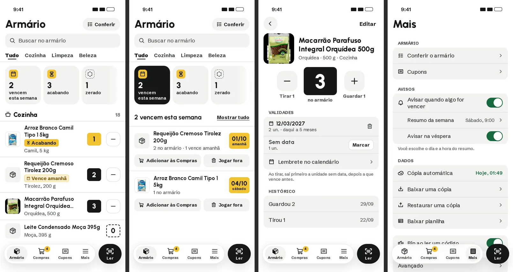
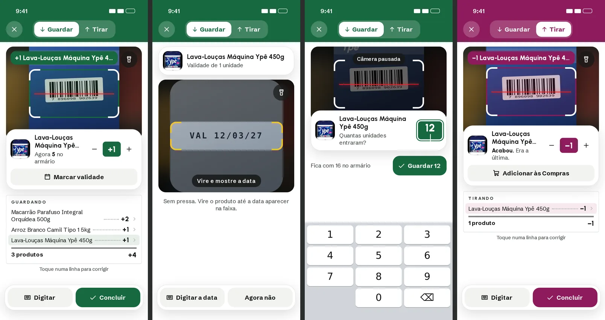
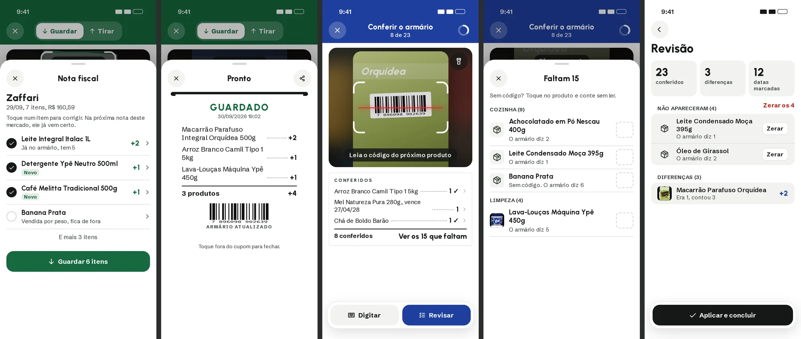

1. **Validade ao guardar:** "Marcar validade" no cartão; a mesma câmera vira a
   faixa de data, na cor do Guardar, com "Digitar a data" e "Agora não".
2. **Nota fiscal:** "Ver os 7 itens" abre a revisão (✓, "Novo", "Banana:
   vendida por peso, fica de fora", "Toque num item para corrigir") e só então
   **Guardar 6 itens**.
3. **Conferir:** "Ver os 15 que faltam" no cupom abre a lista por ambiente,
   com a caixa tracejada e "Sem código? Toque no produto e conte sem ler". Na
   revisão, **Zerar os 4** em bloco, além do Zerar por linha.
4. **Produto:** Tirar 1 e Guardar 1 escritos; nas validades, "2 un. · daqui a 5
   meses", lixeira, "Lembrete no calendário" e "Ao tirar, sai primeiro a
   unidade sem data, depois a que vence antes".
5. **"Pede atenção"** desliza para o lado (como o "Onde fica"), filtra no
   lugar e mostra **zerado** quando há.
6. **Retorno em dobro:** a faixa "+1 Lava-Louças…" volta em cima da câmera, na
   cor do modo, junto do cartão. O cupom mostra que as linhas se tocam (›) e
   "Toque numa linha para corrigir".
7. **Quantidade digitada:** tocar na etiqueta do cartão abre o teclado
   numérico ("Quantas unidades entraram?", "Fica com 16 no armário", **Guardar
   12**).
8. **Fim da sessão:** o cupom impresso "GUARDADO", com compartilhar, e "Toque
   fora do cupom para fechar".
9. **Mais › Dados:** Restaurar uma cópia e Baixar planilha.
10. Textos e 44 px (seção 13 do plano).

### 2.8 As telas que faltavam

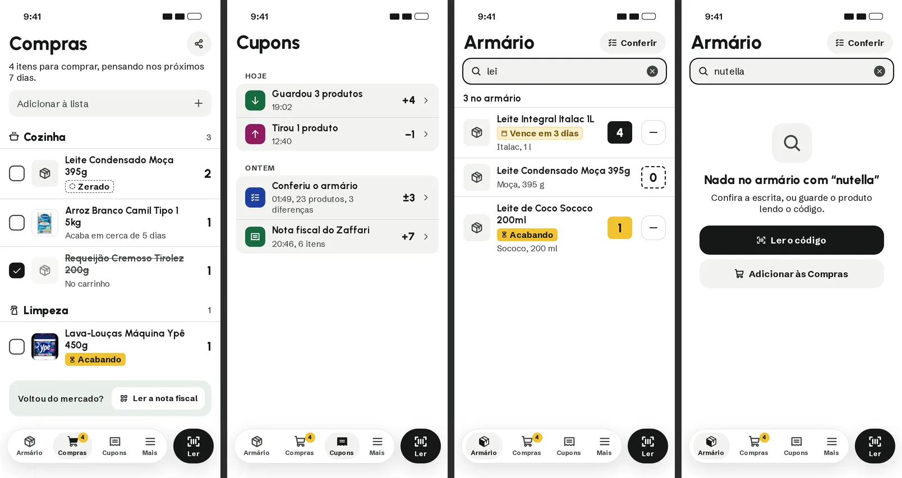
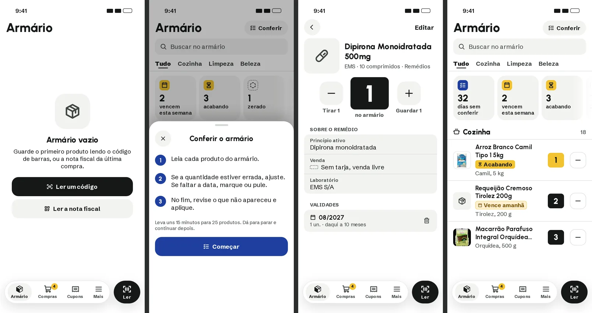
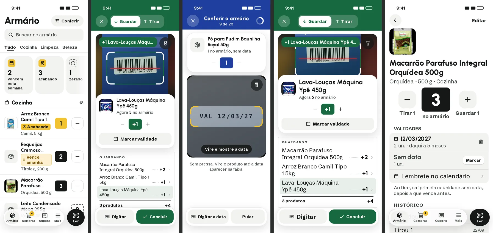

- **Compras:**
  - mesmas linhas e fios, caixa de marcar de 28 px;
  - o marcado fica riscado, "No carrinho";
  - "Adicionar à lista" no alto;
  - no fim, **"Voltou do mercado? Ler a nota fiscal"**, que liga a lista ao
    Guardar.
- **Cupons:**
  - agrupados por dia;
  - ícone na cor do modo (Guardou, Tirou, Conferiu, Nota fiscal);
  - total e a seta › (a pendência antiga "Cupons sem seta").
- **Busca:** filtra no lugar e diz "3 no armário". Sem resultado: "Nada no
  armário com “nutella”", com **Ler o código** e **Adicionar às Compras**.
- **Armário vazio (primeira vez):**
  - sem Conferir e sem "Pede atenção" (não há o que conferir);
  - "Guarde o primeiro produto lendo o código de barras, ou a nota fiscal da
    última compra", com **Ler um código** e **Ler a nota fiscal**.
- **Conferir na primeira vez:**
  - três passos numerados;
  - "Leva uns 15 minutos para 25 produtos. Dá para parar e continuar depois."
    (Da telemetria: ~37 s por produto.)
  - **Começar**, em azul.
- **Remédio:**
  - a mesma página do produto;
  - "Sobre o remédio" em lista (princípio ativo, venda com a tarja sempre
    escrita, laboratório).
- **Lembrete do Conferir:** "32 dias sem conferir" entra primeiro no "Pede
  atenção" depois do intervalo (30 dias por padrão, configurável).
- **320 px:** o cartão da leitura empilha (−/+ embaixo do nome); os botões da
  barra ficam numa linha só.
- **Letra grande (~140%):**
  - o cartão empilha;
  - o nome do produto vai para baixo da foto;
  - o cupom e as validades crescem sem cortar.

### 2.9 Os três jeitos de conferir (decisão B)

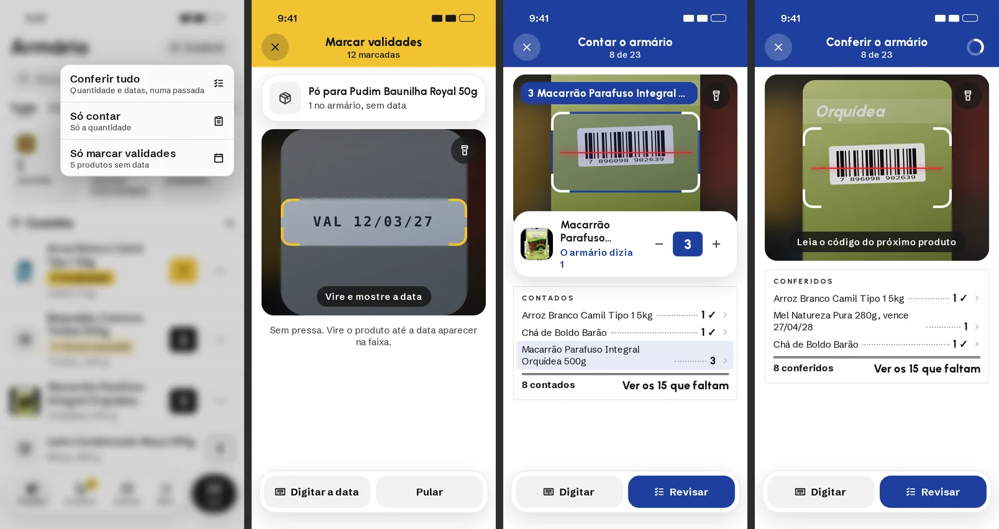

- O botão **Conferir** do Armário abre um menu:
  - **Conferir tudo** ("Quantidade e datas, numa passada");
  - **Só contar** ("Só a quantidade");
  - **Só marcar validades** ("Só as datas que faltam").
  
  Mais › Armário tem as mesmas três linhas. Um lugar só para os três, sem voltar
  a espalhar as entradas.
- **Só marcar validades:**
  - é o modo Validade de hoje no desenho novo, com a faixa âmbar e "12
    marcadas";
  - o produto fica em cima e a faixa da data embaixo;
  - "Digitar a data" e "Pular".
- **Só contar:**
  - faixa azul "Contar o armário · 8 de 23";
  - o cartão com a quantidade contada e "O armário dizia 1";
  - o cupom "Contados", com "Ver os 15 que faltam";
  - nunca pede data.
- **Conferir tudo:** como na seção 2.4.

### 2.10 Remédios

A crítica completa está em [PLANO_MELHORIAS.md, seção 14](PLANO_MELHORIAS.md).

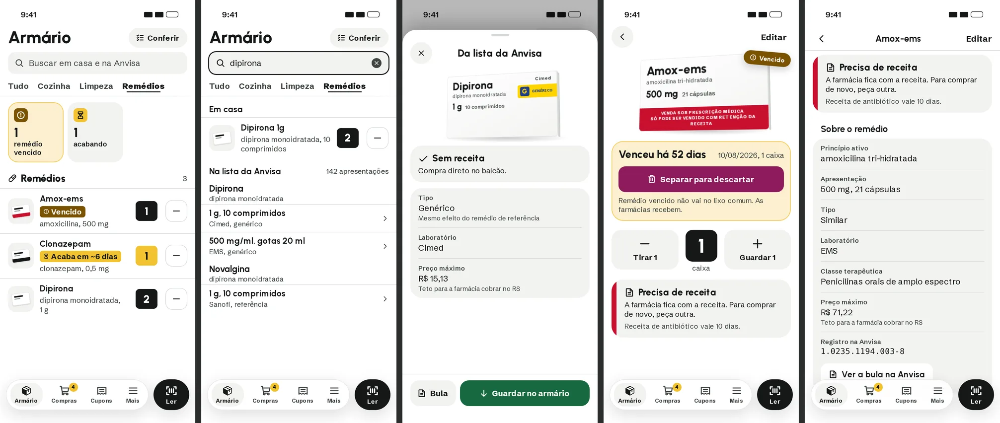
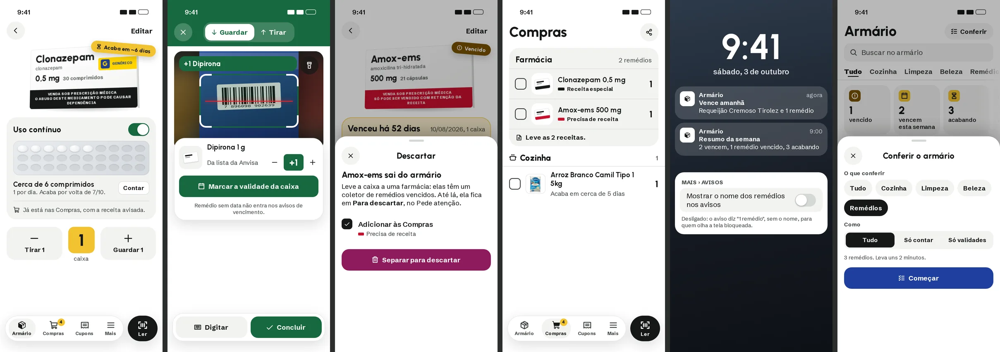

- **A aba Remédios volta.** As abas deslizam e só aparecem os ambientes com
  algo em casa. Com a aba aberta, a busca diz "Buscar em casa e na Anvisa".
- **Linha do remédio:** o nome, e embaixo o princípio ativo e a caixa
  ("amoxicilina · 21 cápsulas"). Vencido tem selo forte; uso contínuo diz
  quando acaba.
- **Busca:** primeiro "Em casa", depois "Na lista da Anvisa" agrupada por
  remédio (dose e quantidade em cada linha, laboratório e tipo embaixo). Sem o
  "Nada no armário" gigante no meio.
- **Folha da Anvisa:**
  - os três dados que decidem (venda, tipo, preço máximo);
  - "Mais sobre o remédio ›";
  - "Ver a bula na Anvisa";
  - **Guardar no armário**.
- **Página do remédio:**
  - o vencido primeiro, com "Remédio vencido não vai no lixo comum. As farmácias
    recebem." e **Separar para descartar**;
  - depois a quantidade (a unidade é **caixa**);
  - depois "Sobre o remédio" em resumo.
- **Leitor:** o cartão diz "Da lista da Anvisa · Remédios" e o botão principal
  é **Marcar a validade da caixa**.
- **Descartar:**
  - o remédio sai do armário e fica em "Para descartar" até levar à farmácia;
  - "Adicionar às Compras" já vem marcado, com a faixa da tarja e "Tarja
    vermelha: precisa de receita".
- **Compras:** os remédios juntos, com "Precisa de receita" (faixa vermelha) ou
  "Precisa de receita especial" (faixa preta).
- **Tela bloqueada:** "Requeijão Cremoso Tirolez e 1 remédio", sem o nome do
  remédio; em Mais › Avisos, "Mostrar o nome dos remédios nos avisos",
  desligado.
- **Conferir um ambiente:** escolher "Remédios" e o jeito, com o tempo
  estimado.

#### 2.10.1 Página e folha do remédio no visual antigo (substituída pela 2.10.2)

A página e a folha acima ficaram sem graça perto das antigas. Esta proposta
**substitui a folha da Anvisa e a página do remédio** desenhadas acima. Volta
o visual antigo e ficam só as melhorias já decididas.

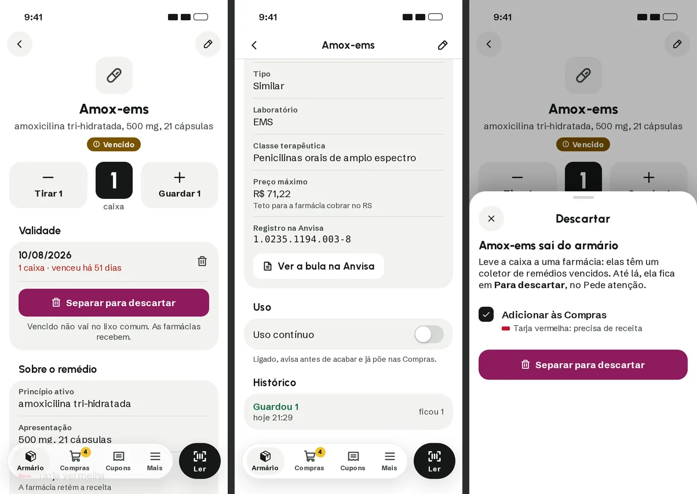
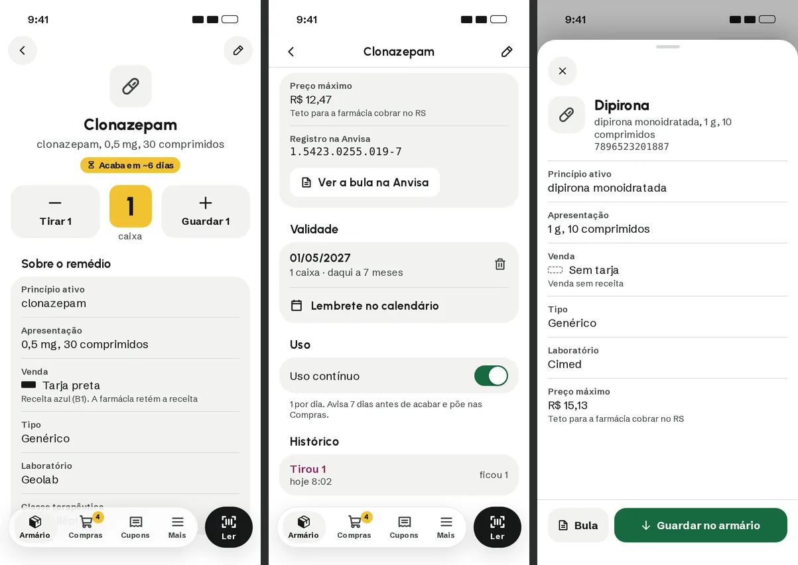

- **Fica do antigo:**
  - ícone, nome e descrição no centro, com o selo embaixo;
  - três botões grandes: Tirar 1, o número e Guardar 1;
  - "Sobre o remédio" com a lista completa (princípio ativo, apresentação,
    venda com a faixa da tarja e a nota, tipo, laboratório, classe
    terapêutica, preço máximo, registro) e "Ver a bula na Anvisa" dentro do
    cartão;
  - a Validade com a lixeira, "venceu há N dias" em vermelho e "Lembrete no
    calendário".
- **Entra do novo:**
  - a unidade é **caixa** ("1 caixa · venceu há 51 dias");
  - **vencido:** a Validade sobe para logo abaixo da quantidade, com
    **Separar para descartar** e "Vencido não vai no lixo comum. As farmácias
    recebem."; o Lembrete some, porque não serve para remédio vencido;
  - sem nada vencido, a ordem é a antiga: quantidade, Sobre o remédio,
    Validade;
  - seção **Uso** com a chave "Uso contínuo". Quando está ligada, mostra o
    ritmo e o aviso ("1 por dia. Avisa 7 dias antes de acabar e põe nas
    Compras."), e o selo do topo diz "Acaba em ~6 dias";
  - o histórico como diário (Guardou 1, Tirou 1);
  - tarja preta com a receita dita ("Receita azul (B1). A farmácia retém a
    receita").
- **Folha da Anvisa:** a lista completa como antes. **Bula** e **Guardar no
  armário** ficam presos embaixo, sempre à vista, sem rolar até o fim.

#### 2.10.2 O remédio como caixa (proposta de 01/10)

A 2.10.1 voltou ao visual antigo, mas a tarja continuava uma faixinha ao lado
de uma palavra. Esta proposta parte do que todo mundo já reconhece: **a
embalagem do remédio.**

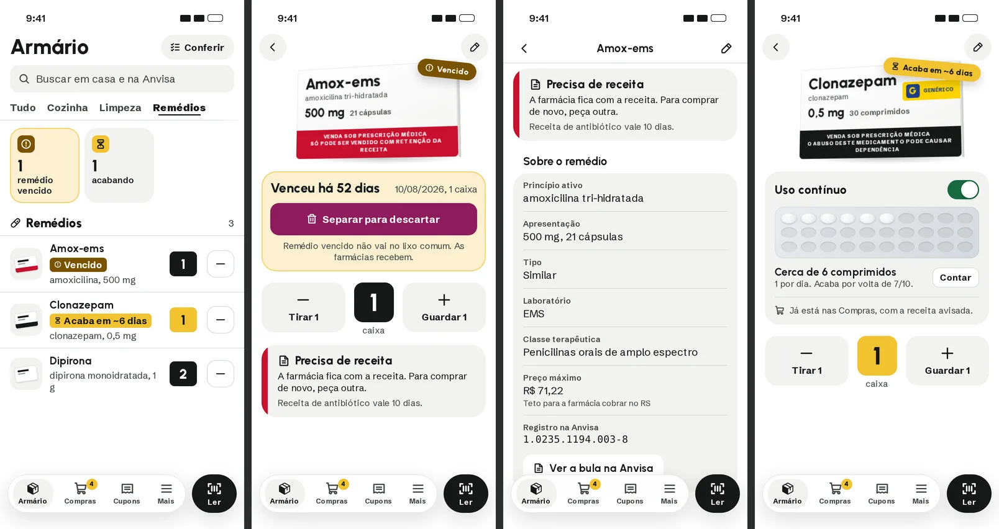
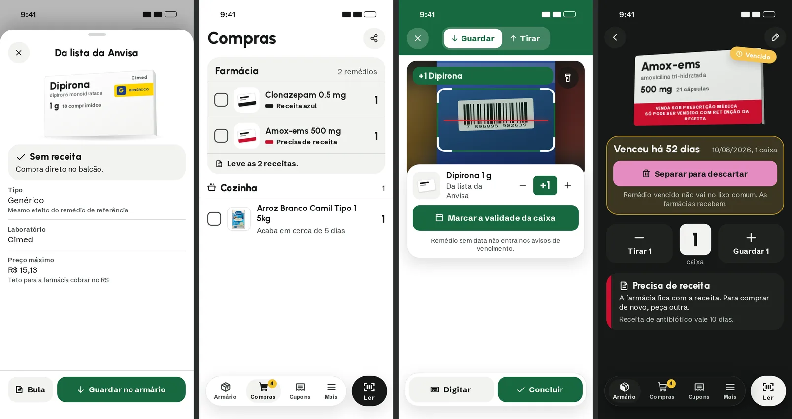

- **A caixa desenhada** no lugar da foto. O desenho sai dos dados da Anvisa:
  - nome comercial grande;
  - princípio ativo, dose e quantidade;
  - laboratório no canto;
  - a **tarja de verdade**: a faixa vermelha ou preta com o texto da
    embalagem ("VENDA SOB PRESCRIÇÃO MÉDICA, SÓ PODE SER VENDIDO COM RETENÇÃO
    DA RECEITA");
  - genérico com a faixa amarela do **G**, como na caixa.

  Remédio continua sem foto, e mesmo assim cada um fica com uma cara
  própria.
- **Caixinha nas listas** (Armário, Compras, leitor): uma miniatura com a
  faixa da tarja embaixo. Dá para ver de longe qual precisa de receita.
- **Selo colado na caixa**, como um adesivo: "Vencido" ou "Acaba em ~6 dias".
- **Vencido:** logo embaixo da caixa, "Venceu há 52 dias" com **Separar para
  descartar** e "Remédio vencido não vai no lixo comum. As farmácias
  recebem.".
- **A tarja vira o que ela quer dizer na prática**, num cartão com a faixa da
  cor dela:
  - vermelha: "Precisa de receita. A farmácia fica com a receita. Para
    comprar de novo, peça outra." e "Receita de antibiótico vale 10 dias.";
  - preta: "Receita azul";
  - sem tarja: "Sem receita. Compra direto no balcão.".

  **Antes de aplicar:** conferir na norma da Anvisa os prazos de cada receita
  (antibiótico, RDC 20/2011; receita azul, Portaria 344/98) e só mostrar o
  prazo quando a classe do remédio deixar certeza.
- **Uso contínuo com cartela:** a chave fica no topo de um cartão com a
  cartela de comprimidos. Os que sobram aparecem cheios, pelo ritmo
  ("Cerca de 6 comprimidos", "1 por dia. Acaba por volta de 7/10."). O botão
  **Contar** corrige, e o cartão avisa "Já está nas Compras, com a receita
  avisada.".
- **Ficha completa** (rolando), como no antigo, com "Ver a bula na Anvisa".
- **Compras: a ida à farmácia** num cartão só ("Farmácia, 2 remédios"). Cada
  remédio mostra a receita que pede (faixa e "Receita azul" ou "Precisa de
  receita"), e o cartão fecha com "Leve as 2 receitas.".
- **Folha da Anvisa:** a caixa, o cartão do que a venda quer dizer, a ficha, e
  **Bula** e **Guardar no armário** presos embaixo.
- **Escuro:** a caixa continua clara, como a de verdade.
- **Sem pontos separadores** em nenhuma tela (DESIGN_SYSTEM, seção 8).

---

## 3. O que isto muda no plano

| Item do plano | Muda para |
|---|---|
| 6.2 voto pelo uso (salvar sem mexer = "é isso") | Voto explícito de um toque, só em nome da comunidade |
| 5.4 "É um destes?" | O que a IA leu no topo como contexto; só resultados da mesma marca e tamanho |
| 8.3 item 12, trocar o cupom por aviso | Cupom vivo no leitor; a impressão no fim fica curta e fechável |
| 7.3 câmera cheia com bandeja | Câmera como janela, cartão sólido e cupom vivo (volta ao design system) |
| 7.4 "Sem código? Buscar pelo nome" | "Digitar" na barra de baixo (código ou nome) |
| Entrada / Saída no leitor | Guardar / Tirar |
| Ordem de execução | Backup automático logo depois da telemetria |
| Contar em Mais, Validade e Nota fiscal no Armário | "Conferir" no topo do Armário (e em Mais); Nota fiscal dentro do leitor |

## 4. Decidido e em aberto

**Decidido (30/09):**

- **Conferir, Só contar e Só marcar validades continuam os três** (seção 2.9).
- **Fim do Conferir: "Aplicar e concluir".**
- **Bips diferentes:** sobe para Guardar, desce para Tirar.
- **O leitor sempre abre em Guardar.**
- **Aviso de vencimento configurável:** dia e hora do resumo, e véspera liga
  ou desliga.
- **"Pede atenção":** vencidos, vencem esta semana, acabando, zerados e dias
  sem conferir, nessa ordem, cada um só quando houver. "Sem data" vai para o
  menu do Conferir.
- **Histórico como diário:** Guardou 2, Tirou 1, Contou 3 (eram 1), Marcou a
  validade…, Jogou fora 1.

- **Remédios:** chave "Uso contínuo", sim. Nome nos avisos, backup cifrado e
  telemetria sem nomes de remédio ficam para antes de abrir o app a outras
  pessoas (PLANO_MELHORIAS, seção 15); o desenho da tela bloqueada e da opção
  em Mais › Avisos já está pronto para essa hora.

**Em aberto:** nada. O design está fechado para aplicar.
