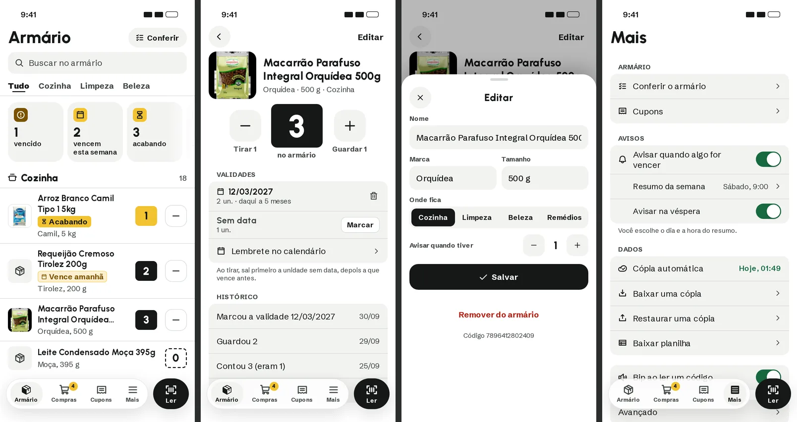
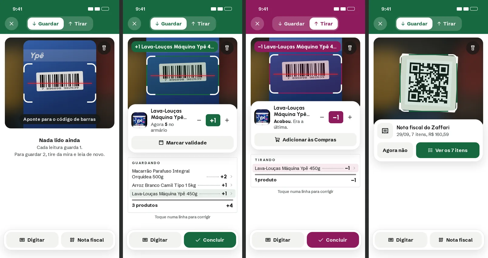
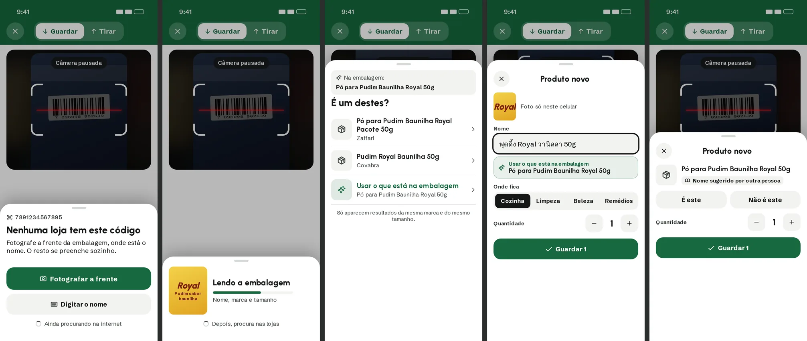
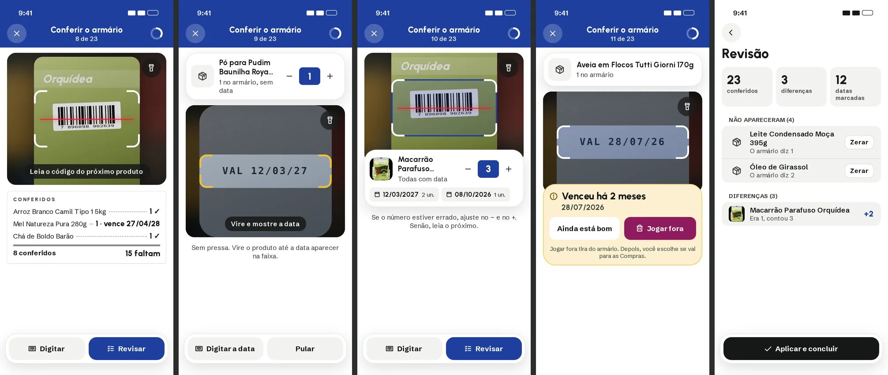
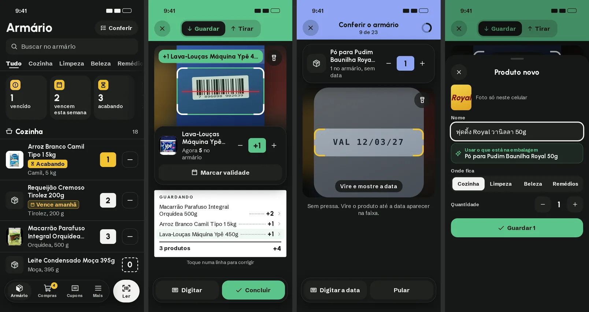
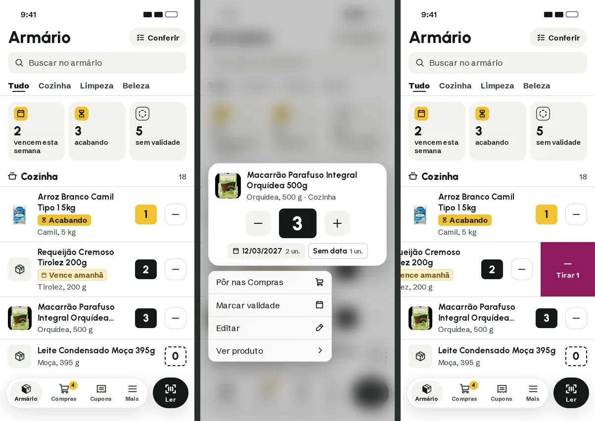
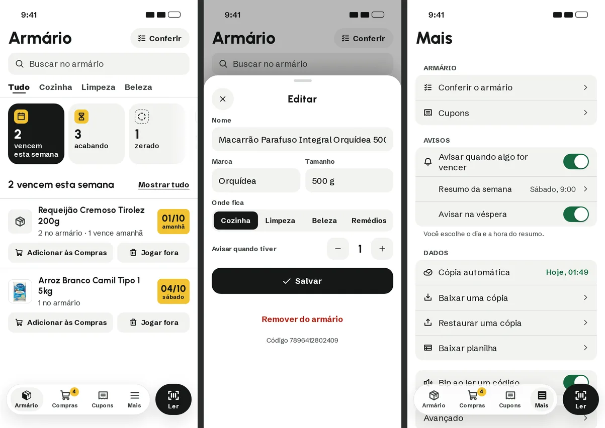

# Design novo (proposta de 30/09/2026)

Crítica do [plano de melhorias](PLANO_MELHORIAS.md) e o desenho que sai dela:
câmera, todos os modos e as telas do app. **Nada disto está no app.** É para
discutir antes de aplicar.

Critérios usados: o nosso [design system](DESIGN_SYSTEM.md) (direção "caixa
do mercado"), a [HIG da Apple](APPLE_HIG.md), retorno, fricção, obscuridade,
posição na tela e ciência do comportamento.

---

## 1. Crítica do plano

Está em [PLANO_MELHORIAS.md, seção 11](PLANO_MELHORIAS.md#11-crítica-do-plano-30092026).
Resumo: a saída esquecida é o maior risco; defesas contra erro de modo; voto
explícito na comunidade; "É um destes?" filtrado por marca e tamanho; textos
que não falam de si; o cupom fica; o desenho volta ao design system; o
Conferir precisa de progresso e de "Pular"; a câmera espera o produto virar;
câmera pausada visível; uma folha por vez; nada se mexe quando a internet
responde; backup mais cedo; aviso de vencimento com hora certa.

---

## 2. O desenho novo

### 2.1 App: Armário, Produto, Editar e Mais

- **Armário:**
  - uma ação só no topo, **"Conferir"**, ao lado do título grande (HIG). Saem
    as pílulas Validade e Nota fiscal;
  - **"Pede atenção"** no lugar dos filtros Acabando, Zerados e Vencendo: "2
    vencem esta semana", "3 acabando", "5 sem validade". Cada um abre a ação
    certa;
  - o botão **Ler tem cor fixa** (preto, branco no escuro); a cor do modo
    aparece só dentro do leitor;
  - 4 abas de ambiente, que cabem em 320 px.
- **Produto:**
  - foto, nome, **−/3/+** com a etiqueta grande, Validades (com "Marcar" na
    linha sem data) e Histórico;
  - saem a quantidade repetida no Editar, o "Onde fica" repetido, o quadro
    Consumo vazio e o "Nome estranho?".
- **Editar:** Salvar em destaque. **"Remover do armário" em texto vermelho,
  longe, no fim.** O código do produto fica em nota de rodapé.
- **Mais:**
  - só o que é da pessoa: Conferir o armário, Cupons, Avisos, Seus dados (cópia
    automática com a hora da última) e Som;
  - o técnico (Diagnóstico, Testes) vai para **Avançado**, no fim.

### 2.2 Leitor: Guardar e Tirar

- **Faixa na cor do modo**, com o seletor **Guardar / Tirar** no alto.
- **Câmera como janela**, com a mira de código e a **linha vermelha do caixa**.
  Lanterna no canto, em vidro.
- **Leu:**
  - moldura na cor do modo;
  - **cartão sólido** encostado na câmera: foto, nome, "Agora 5 no armário" e
    **− [+1] +** (a etiqueta na cor do modo);
  - o −/+ substitui o "Rápido" e o Desfazer.
- **Cupom vivo** embaixo, com a linha nova destacada e o total sob o traço duplo.
- **Barra de baixo** (vidro): **Digitar** e **Nota fiscal**, depois **Digitar**
  e **Concluir**. Tudo com nome, ao alcance do polegar.
- **Tirar que acaba:** "Acabou. Era a última." e **Pôr nas Compras**.
- **Nota fiscal:** no Guardar, a câmera reconhece o QR Code sozinha: "Nota fiscal
  do Zaffari · 29/09 · 7 itens · R$ 160,59" com **Guardar os 7**. O botão Nota
  fiscal continua na barra, para quem não sabe que é só apontar.
- **Vazio:** "Nada lido ainda. Cada leitura guarda 1. Leu duas vezes, guarda
  2." (No lugar do vazio grande de hoje.)

### 2.3 Código novo

1. **Nenhuma loja tem este código** (aos ~2,5 s):
   - a câmera escurece com "Câmera pausada";
   - botão principal **Fotografar a frente**, com o texto "Fotografe a frente da
     embalagem, onde está o nome";
   - secundário **Digitar o nome**;
   - embaixo, "Ainda procurando na internet".
2. **Lendo a embalagem:** a foto à vista, barra de progresso, "Nome, marca e
   tamanho", depois "Procura nas lojas".
3. **É um destes?**
   - "Na embalagem: …" no topo;
   - só resultados da mesma marca e tamanho;
   - **Usar o que está na embalagem** por último;
   - rodapé explicando o filtro.
4. **Produto novo:**
   - a foto da frente com **"Foto só neste celular"**;
   - ao tocar no nome (aqui, um nome estranho vindo da busca), aparece **"Usar
     o que está na embalagem: Pó para Pudim Baunilha Royal 50g"**;
   - Onde fica, Quantidade e **Guardar 1**.
5. **Nome da comunidade:** o nome com o selo **"Nome sugerido por outra
   pessoa"** e o voto de um toque **É este / Não é este**.

### 2.4 Conferir o armário (Contar + Validade)

- **Faixa azul** (a cor da Contagem) com "Conferir o armário · 8 de 23" e o
  anel de progresso.
- **Cupom "Conferidos"** com ✓ ou a data marcada, e "8 conferidos · 15 faltam".
- **Produto sem data:**
  - o cartão sobe para o topo, com a quantidade ajustável;
  - a mira vira **faixa de data** (amarela), com **"Vire e mostre a data"**;
  - embaixo, **Digitar a data** e **Pular**.
- **Já tem data:** sem folha. O cartão mostra as datas (12/03/2027 · 2 un.,
  08/10/2026 · 1 un.) e "Confere? Leia o próximo. Se o número está errado,
  ajuste no − e +."
- **Vencido:** "**Venceu há 2 meses** · 28/07/2026", com **Joguei fora** (cor do
  Tirar) e **Ainda está bom**. Rodapé: "Joguei fora tira do armário. Você
  escolhe se vai para as Compras."
- **Revisão:**
  - resumo em números (conferidos, diferenças, datas marcadas);
  - **Não apareceram**, com "Acabou" na linha;
  - **Diferenças** ("Era 1, contou 3 · +2");
  - **Aplicar e concluir**.

### 2.5 Escuro

As mesmas regras, com as cores escuras do design system: faixas em tom claro
com texto escuro, papel escuro, o cupom continua claro (é papel).

### 2.6 Home (Armário) e o editar dela

A mesma ideia do leitor (cartão com −/+, etiqueta, fios) levada para a home:

- **Linha do Armário:** foto, nome em até 2 linhas, etiqueta de gôndola e o
  **−** de 44 px (Tirar 1 sem abrir nada). Produto zerado não tem o −.
- **Toque longo:** em vez da lista de texto de hoje, sobe **o mesmo cartão do
  leitor**:
  - foto, nome, **−/3/+** e as validades ("12/03/2027 · 2 un.", "Sem data · 1
    un.");
  - embaixo, um menu curto: **Pôr nas Compras, Marcar validade, Editar, Ver
    produto**;
  - Tirar 1 e Guardar 1 saem do menu, porque o −/+ do cartão já faz isso;
  - o fundo desfoca, como no iPhone.
- **Arrastar para a esquerda:** **Tirar 1** na cor do Tirar (o gesto que já
  existe).
- **"Pede atenção" aberto (Vencem esta semana):**
  - a data vira a etiqueta ("01/10 amanhã", em amarelo);
  - na própria linha, **Pôr nas Compras** e **Joguei fora**;
  - o que vence depois fica em "Depois", mais apagado.
- **Editar (pela home ou pelo produto), a mesma folha:**
  - Nome;
  - Marca e Tamanho lado a lado;
  - Onde fica;
  - Avisar quando tiver;
  - **Salvar**;
  - **Remover do armário** em texto vermelho, no fim;
  - o código em nota de rodapé.
  
  Sai a quantidade grande do topo (ela está no −/+ do cartão e do produto).
- **Mais › Avisos:** "Quando algo for vencer", **Resumo da semana (Sábado,
  9:00 ›)**, que a pessoa escolhe, e **Aviso na véspera**.

---

## 3. O que isto muda no plano

| Item do plano | Muda para |
|---|---|
| 6.2 voto pelo uso (salvar sem mexer = "é isso") | Voto explícito de um toque, só em nome da comunidade |
| 5.4 "É um destes?" | O que a IA leu no topo como contexto; só resultados da mesma marca e tamanho |
| 8.3 item 12, trocar o cupom por aviso | Cupom vivo no leitor; a impressão no fim fica curta e fechável |
| 7.3 câmera cheia com bandeja | Câmera como janela, cartão sólido e cupom vivo (volta ao design system) |
| 7.4 "Sem código? Buscar pelo nome" | "Digitar" na barra de baixo (código ou nome) |
| Entrada / Saída no leitor | Guardar / Tirar |
| Ordem de execução | Backup automático logo depois da telemetria |
| Contar em Mais, Validade e Nota fiscal no Armário | "Conferir" no topo do Armário (e em Mais); Nota fiscal dentro do leitor |

## 4. Decidido e em aberto

**Decidido (30/09):**

- **Bips diferentes:** sobe para Guardar, desce para Tirar.
- **O leitor sempre abre em Guardar.**
- **Aviso de vencimento configurável:** dia e hora do resumo, e véspera liga
  ou desliga.

**Em aberto:**

1. "Pede atenção": os três blocos (vencem, acabando, sem validade), ou outros?
2. **Conferir e os dois modos de hoje.** Hoje existem duas tarefas separadas:
   **Contar** (em Mais: passar por todos os produtos contando as quantidades e
   revisar no fim) e o **modo Validade** (ler um produto e marcar a data). O
   Conferir junta as duas numa passada. A pergunta é se o Contar e o modo
   Validade **somem** (só existe o Conferir, com a data sempre opcional pelo
   "Pular"), ou se **continuam também**, para quando você quer só contar, ou
   só marcar a data de um produto. Minha recomendação: só o Conferir. Marcar
   a data de um produto solto já dá pelo cartão (toque longo › Marcar
   validade) e pela página do produto.
