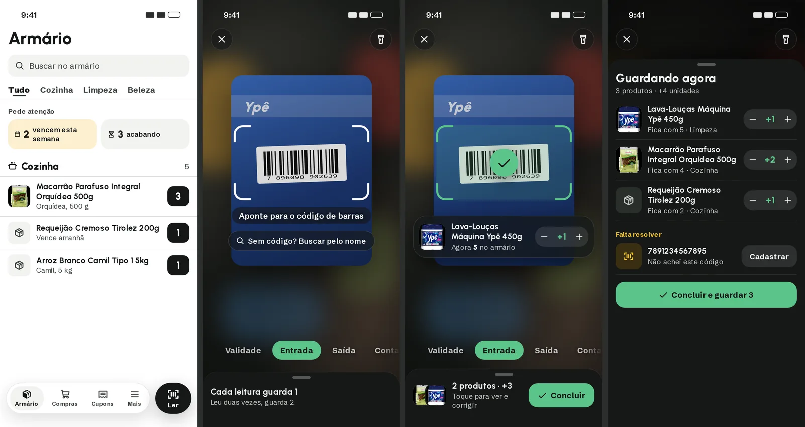
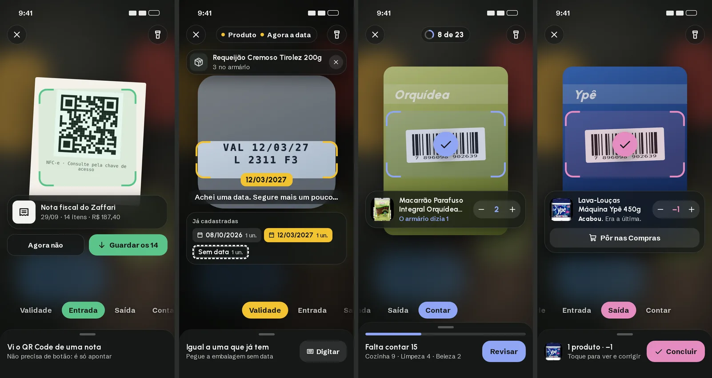
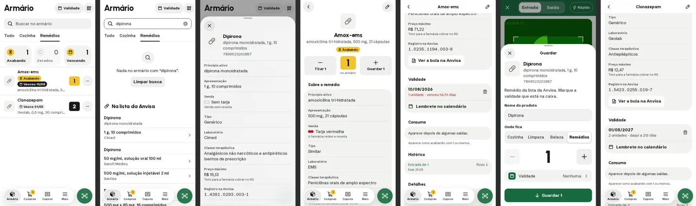

# Plano de melhorias (conversa de 30/09/2026)

Tudo o que foi conversado e decidido na revisão geral do app, na telemetria da
primeira noite de uso do modo Validade e no redesenho da câmera e do fluxo do
código de barras. **Nada daqui está feito.** Cada item diz o estado:

- **Decidido**: vocês aprovaram; é para fazer assim.
- **Proposto**: sugestão minha, sem resposta ainda. Confirmar antes de fazer.
- **Descartado**: foi discutido e não vai ser feito; o motivo fica anotado
  para a ideia não voltar sem querer.

O [ROADMAP](ROADMAP.md) tem o resumo; este documento tem os detalhes.
A crítica deste plano e o desenho que sai dela estão em
[DESIGN_NOVO.md](DESIGN_NOVO.md); onde os dois divergem, vale o DESIGN_NOVO
(seção 3 dele).

---

## 1. Como decidimos

1. **Discutir antes de fazer.** Toda sugestão é apresentada e aprovada antes de
   virar código.
2. **O app está sendo feito agora.** Reaprender a usar não é custo: se uma ideia
   melhor pedir para mudar uma tela inteira, ou o app inteiro, muda. Uma
   proposta não perde pontos por ser diferente do que existe.
3. **O botão "Validade" no topo do Armário não é requisito.** Foi uma ideia do
   momento; pode sair de lá ou mudar de lugar.
4. **Foto tirada pela pessoa nunca vai para o catálogo compartilhado** (LGPD).
   Fica só no celular de quem tirou.
5. **Nome digitado à mão nunca vai para o catálogo compartilhado.** Pode ser
   pessoal ("pote da vó", "remédio da Ana") ou abreviado.
6. **Mexer na leitura da câmera só com telemetria.** O desenho da tela pode
   ser discutido; o que muda como a câmera lê (recorte, resolução, tempos)
   espera os dados.
7. **Diretrizes:** o nosso [design system](DESIGN_SYSTEM.md) e a
   [HIG da Apple](APPLE_HIG.md) como referência.

---

### 1.1 Decididas depois do desenho novo

- **Bips diferentes:** um que sobe para Guardar e um que desce para Tirar.
- **O leitor sempre abre em Guardar**, o modo inicial (não no último usado).
- **O aviso de vencimento é configurável:** a pessoa escolhe o dia e a hora do
  resumo da semana e liga ou desliga o aviso na véspera (Mais › Avisos).
- **A crítica do plano** fica neste documento (seção 11).
- **Conferir, Contar e Validade: os três continuam** (opção B). O Conferir faz
  quantidade e datas numa passada; "Só contar" e "Só marcar validades" seguem
  existindo. Os três saem do mesmo botão "Conferir" do Armário (um menu) e de
  Mais, para não voltar a espalhar as entradas.
- **Fim do Conferir: "Aplicar e concluir".**
- **"Pede atenção", do mais urgente ao menos:** vencidos, vencem esta semana,
  acabando, zerados e dias sem conferir. Cada bloco some quando está em zero.
  **"Sem data" sai** (nunca zera, porque sal e açúcar não têm data, e vira
  paisagem); o número vai para o menu do Conferir ("Só marcar validades · 5
  produtos sem data").
- **Remédios:** chave "Uso contínuo" (sim). As proteções de privacidade dos
  remédios ficam para antes de abrir o app a outras pessoas (seção 15).
- **Histórico em forma de diário, com os verbos dos botões:** "Guardou 2",
  "Tirou 1", "Contou 3 (eram 1)", "Marcou a validade 12/03/2027", "Jogou fora
  1". Sai "Entrada de 4". Atualizar os termos fixos do design system (seção 8)
  quando aplicar.

## 2. Ordem de execução (proposta)

1. **Telemetria nova** (seção 3.3). Pequena, invisível, e mede o que falta
   para decidir o resto.
2. **Repassador mais rápido** (seção 5.2).
3. **O novo "não achou" com a foto da frente** (seção 5.3 e 5.4).
4. **Nomes da comunidade** (seção 6).
5. **Melhorias do modo Validade** (seção 4).
6. **Pequenos da revisão geral** (seção 8.1).
7. **Câmera nova** (seção 7), com os dados da telemetria em mãos.

Depois: aviso de vencimento, backup automático e os dois celulares com o mesmo
armário (seção 9).

---

## 3. Telemetria

### 3.1 O que a noite de 29 para 30/09 mostrou

Uso real do modo Validade, de 01:31 a 01:49, num iPhone (393×852, iOS 18.7,
app instalado na tela de início, versão v87):

- **27 produtos com data marcada em 17 minutos**, uns 37 s por produto.
- **Nenhum erro registrado** na sessão; a GPU funcionou o tempo todo.
- A câmera da data lê o texto da imagem **2,2 vezes por segundo** (é a régua
  para comparar mudanças futuras; uma data precisa, em média, de ~15 leituras).
- A câmera pede imagem **2160×3840 (4K) a 30 q/s**.

Como terminou cada câmera da data (39 no total):

| Como terminou | Vezes | Salvou | Tempo típico |
|---|---|---|---|
| Achou a data sozinha | 15 | 13 | data na tela em ~3 s; confirma ~1 s depois |
| Achou; vocês tocaram na data | 9 | 7 | data na tela em ~6,5 s; ~3 s até o toque |
| Perguntou "É esta data?" | 3 | 2 | ~7 s |
| Vocês digitaram | 7 | 7 | 3 delas depois de 30–40 s de tentativa |
| Saíram da câmera | 4 | 0 | 1–3 s |
| Painel da foto | 1 | 0 | 20 s |

Resultados do modo Validade (40): marcou 29, "todas já têm data" 7, fechou 3,
"não está no armário" 1.

Onde vai o tempo de cada produto (medianas):

| Etapa | Tempo |
|---|---|
| Do fim do produto anterior até a câmera da data abrir (pegar o próximo e ler o código) | **~12 s** |
| Câmera da data | ~7 s |
| Confirmar | ~2,3 s |

**Tempo de virar o produto.** Entre ler o código e ler a data, a pessoa vira o
produto: a data quase nunca está na mesma face do código. Quando está, a data
aparece em 0,9–1 s; quando precisa virar, em 3–6 s. Metade apareceu em até
3 s. **A tela não pode exigir nada nesse intervalo.**

**Digitar a data leva 9 a 20 s** (refrescos em pó, café solúvel, pêssego em
calda, chocolate em pó).

**Os pontos fracos da câmera:** refresco em pó (Tang) e café solúvel. Três
tentativas de 30–40 s com 5 fotos cada, e depois digitaram. No terceiro Tang,
foram direto digitar em 2,5 s: aprenderam que não funciona.

**Datas vencidas:** 8 datas lidas já tinham passado. 4 foram salvas e estavam
**certas**, eram produtos vencidos mesmo (Salgadinho Pastelina, Erdbeemarmelade,
Café Baggio, Aveia Tutti Giorni); 2 eram os potes velhos do teste (Ervas Finas
e Pimenta Mercatto, seção 3.2); 2 eram erro de ano (abaixo). Em uma noite, 6
produtos vencidos no armário.

**Erro de ano:** a câmera leu 18/02/2024 onde era 18/02/2027 (pó para pudim)
e 29/12/2025 onde era 29/12/2028 (pêssego em calda). Vocês perceberam e
digitaram. É o padrão "FAB 18/02/24 · VAL 18/02/27": a validade cai no mesmo
dia e mês da fabricação, anos depois, e nessas embalagens não havia o rótulo
"FAB" que o app já sabe descartar.

### 3.2 O que desconsiderar (contado por vocês)

- **Ervas Finas e Pimenta Mercatto:** teste de leitura em potes redondos, com
  potes velhos. As datas vencidas lidas ali não são erro.
- **Água Voss:** teste. Mas o defeito que apareceu é real: o nome veio em
  tailandês (seção 5.5).
- **Vaivém Compras → Cupons → Mais às 21:49 e 22:56:** conferência das
  animações, não alguém perdido.
- **O app reabrindo às 01:31:** vocês fecharam e abriram para o iPhone pedir a
  permissão da câmera de novo (tinha sido negada sem querer). Não foi queda.
- **O último produto, às 01:49 (duas leituras sem salvar):** foram dormir.

### 3.3 O que acrescentar (Proposto)

Nada disso aparece na tela.

1. **Identificador aleatório por aparelho**, para separar o uso dos dois
   celulares (hoje aparecem iguais). Não identifica a pessoa. Também serve
   para os votos da comunidade (seção 6).
2. **Tempo de leitura do código** no modo Validade (hoje não dá para separar
   "pegar o produto" de "a câmera demorar").
3. **Tempo de cada etapa do repassador** no `/lookup`: catálogo próprio, cada
   loja, catálogos de código, web, foto (seção 5.1).
4. **Resumo de cada Entrada e Saída:** produtos, unidades, correções de
   quantidade, Desfazer, códigos não achados, duração.
5. **Troca de modo seguida de Desfazer** (guardou em vez de tirar e corrigiu):
   mede se a troca sem querer acontece.
6. **Diferenças da Contagem:** quanto o armário do app difere do real, e em
   quais produtos (sinal de Saída esquecida).
7. **Busca sem resultado**, no Armário e no "buscar pelo nome".
8. **Tempo para o app abrir** até a lista aparecer.
9. **Câmera negada ou que não abriu** (`NotAllowedError` e afins).
10. **Reabertura do app sem ter sido fechado** (para diferenciar queda de
    fechamento).

---

## 4. Modo Validade

### 4.1 Aviso em cima de uma câmera que parece viva (Decidido o problema; forma Proposta)

**Problema.** Quando o produto já tem todas as datas, abre uma folha "Todas as
N unidades já têm data". Vocês usavam isso **de propósito, para conferir** o
armário. Mas às vezes ele não percebia que a folha abriu: a imagem da câmera
continua ao vivo em cima, com a leitura **pausada** (o código confirma:
`handling` pausa o leitor, o vídeo segue). Parece que está funcionando, então
ele continuava apontando.

**Proposta.** Nenhum aviso abre em cima de uma câmera que parece viva, em
nenhum lugar do app:

- ou a imagem **congela e escurece** enquanto o aviso está aberto;
- ou o aviso aparece **em cima da própria câmera**, como o cartão do desenho
  novo (seção 7), com as datas que o produto já tem, e a câmera segue lendo.

Para "todas já têm data", a segunda forma serve à conferência: mostra as datas
e deixa ler o próximo.

### 4.2 Data vencida: o app age (Proposto)

Quando a data lida já passou, dizer com destaque "Venceu há 6 meses" e
oferecer **"Joguei fora"**: tira do armário e, se quiserem, põe nas Compras.
É o momento em que a pessoa está com o produto vencido na mão.

(A ideia anterior, "data vencida nunca é salva sozinha", foi **descartada**:
as datas vencidas lidas estavam certas.)

### 4.3 Fabricação e validade com o mesmo dia e mês (Proposto)

Regra: se o mesmo produto mostra duas datas com o **mesmo dia e mês** e anos
diferentes, fica a **mais distante**. Resolve os dois erros de ano da noite.
Hoje `js/dates.js` só descarta a fabricação quando há o rótulo FAB/PROD/EMB.

### 4.4 "Está difícil" chega tarde (Proposto)

Hoje aparece aos **35 s** (`HARD_AFTER_MS`); vocês desistiram entre 30 e 40 s.
Oferecer "Digitar" com destaque por volta de **12–15 s** sem achar nada.

### 4.5 Digitar a data (Decidido)

**Digitar continua sendo o jeito.** O campo "DD/MM/AA" no teclado numérico
fica como está.

**Descartado:** rodinhas do iPhone e grade de meses/anos. "Normalmente só
servem para atrapalhar."

### 4.6 Quando a data vira botão (Proposto, investigar)

Quando a câmera confirma sozinha, é ~1 s depois de mostrar. Quando vira
botão, vocês esperam ~3 s antes de tocar: parece que ficam esperando para ver
se ela confirma sozinha. O botão tem de deixar claro que é para tocar.

### 4.7 Uma câmera só para o código e a data (Proposto, medir antes)

Ler o código leva ~12 s por produto, mais que a data. Parte é pegar o
produto; a suspeita é que outra parte seja a troca de câmera (a do código
para, a da data abre; no iPhone isso reinicia a imagem). Medir (seção 3.3,
item 2) antes de mudar.

### 4.8 Produto fora do armário no meio da conferência (Proposto)

Hoje o app manda para a Entrada, e é preciso voltar ao modo Validade e ler de
novo. Proposta: "Guardar 1 e marcar a data" ali mesmo. (O caso da noite foi a
Voss, um teste, mas numa conferência do armário vai acontecer de verdade.)

### 4.9 "Conferir o armário": Contar e Validade juntos (Proposto, sem resposta)

Vocês usaram a Validade para conferir o armário, que é o que a Contagem faz.
Numa passada só: cada leitura confirma que o produto existe, pede a data se
faltar e mostra a que tem se não faltar; no fim, a revisão do que não
apareceu.

### 4.10 Câmera negada (Decidido)

A mensagem de hoje diz "libere nos ajustes do navegador", que não ajuda no
app instalado no iPhone. Trocar por: **"Feche e abra o app de novo para o
iPhone perguntar outra vez."** (É uma aba do Safari se passando por app;
fechar e abrir funciona. Num app de loja seria nos Ajustes.) Registrar na
telemetria (seção 3.3, item 9).

---

## 5. Fluxo do código de barras

### 5.1 Como é hoje (diagnóstico)

Quando o código **já está no armário**, é instantâneo. Quando é **novo**:

1. A câmera lê e **abre uma folha que prende a pessoa**: "Procurando no armário
   e nas lojas". Aos 3,5 s: "A loja está demorando"; aos 7 s: "Se preferir,
   digite o nome". O app espera o `/lookup` **até 20 s** e, em paralelo, o Open
   Food Facts e irmãos (até 8 s).
2. O repassador (`worker/src/index.js`, `lookup` e `lookupLive`) busca **em
   fila**:
   1. catálogo próprio (D1);
   2. **24 lojas** ao mesmo tempo (`lookupStores`). Vale a primeira que achar;
      se não foi a Zaffari, **espera a Zaffari até 0,8 s**. Se **nenhuma** tem,
      espera a mais lenta desistir (`STORE_TIMEOUT` = **5 s**);
   3. **só depois**, os catálogos de código (CadastroProduto, Systax, e Cosmos
      e Kodebar quando há chave);
   4. **só depois**, a web (Tavily; básica e, se couber no prazo de 17 s, a
      avançada);
   5. se o nome veio sem foto, **procura a foto antes de responder**
      (`findPhoto`: Cosmos e imagens da web, com redução na Cloudflare).
3. Volta **um nome só**, o primeiro que alguém achou, sem avaliar a qualidade
   (por isso o título tailandês da Voss passou).
4. A foto para a IA (`/identify`) só aparece quando **ninguém achou nada**.
5. Com o **Rápido** ligado, o código novo vai para "Para resolver" e nada é
   procurado até a pessoa tocar.

**Sintoma relatado:** um código novo leva uns **4–5 s**; antes das fontes novas
era menos. Principal suspeito: a foto procurada antes de responder (item 2.5),
seguido da fila (2.2 → 2.3 → 2.4). Confirmar com o tempo de cada etapa
(seção 3.3, item 3): até agora a telemetria só pegou duas consultas (Bombom
Stikadinho em 1,5 s numa loja; Voss em 9–10 s pela web).

### 5.2 Repassador mais rápido (Decidido)

- **Tudo o que é grátis começa junto:** catálogo próprio, lojas e catálogos de
  código (CadastroProduto, Systax). Vale o melhor que chegar primeiro, com uma
  folga curta para a loja preferida.
- **O que tem cota** (Cosmos, Kodebar, web/Tavily) entra quando os grátis
  falharem, ou a web aos **~2,5 s** sem nada.
- **Prazo menor para loja lenta:** com o tempo de cada loja medido, cortar de
  5 s para ~2,5 s, ou tirar a loja que nunca acha nada.
- **O nome primeiro, a foto depois:** o repassador responde o nome na hora; a
  foto chega depois, sozinha (por exemplo, `/foto/{código}` gerada quando for
  pedida).

**Meta:** achado numa loja em ~1–1,5 s; não achado, as opções aparecem em
~2,5–3 s (hoje, 8 a 17 s).

### 5.3 Quando não acha (Decidido)

As opções aparecem **assim que lojas e catálogos falham**, sem esperar a web:

1. **Leu o código.** "Procurando…" (0 a ~2,5 s).
2. **Lojas e catálogos sem nada.** A folha muda na hora:
   - título: **"Não achei este código nas lojas"**;
   - botão principal: **"Fotografar a frente da embalagem"**. O texto diz "a
     frente" de propósito: a pessoa está com o produto virado, mostrando o
     código;
   - botão secundário: **"Digitar o nome"**;
   - embaixo, discreto: "Ainda procurando na internet…".
   - Se a web achar enquanto a pessoa decide, aparece em cima: **"Achei na
     internet: X · É esse?"**, com Sim e Não.
3. **Digitar o nome:** como hoje, com as sugestões das lojas enquanto digita.
   Salvou, pronto. O nome digitado fica só no celular (seção 1, item 5).

### 5.4 Foto da frente → IA → busca (Decidido)

1. Abre a câmera normal do iPhone (a que o app já usa, `input capture`).
2. "Lendo a embalagem…" (~5 s). A IA lê **nome, marca e tamanho**.
3. Com isso, **procura nas lojas** (e na web, se as lojas não tiverem).
4. Mostra **"É um destes?"**, com foto de cada resultado. O último item da lista
   é sempre **"Usar o que a IA leu: 'Nome lido'"**.
5. A pessoa escolhe; o formulário vem preenchido.
6. **Ao tocar para editar o nome**, se o nome escolhido veio da busca (e não
   da própria IA), aparece logo abaixo do campo: **"Usar o que a IA leu na
   embalagem: 'Nome lido'"**. Um toque troca. Isso evita ficar com um nome
   "em aramaico" que a busca trouxe.
   - Só nesse caso. **Descartado:** oferecer "Ler o nome na embalagem" em toda
     edição de nome (seria um segundo caminho).
7. **A foto da frente vira a foto do produto no celular de quem tirou.** Não
   vai para o catálogo compartilhado.
8. **O nome** resolvido assim vai para o catálogo como **nome da comunidade**
   (seção 6).

**Descartado:** usar a imagem do momento da leitura do código para a IA ler o
nome. Na leitura, a embalagem está **de costas**, só com o código de barras; a
IA não teria o que ler.

**Descartado junto (não seguiu):** a proposta de três etapas sem folha
("ler / descobrir em segundo plano / confirmar depois", com linhas "Procurando…"
na sessão e o fim do Rápido). Se voltar, rediscutir do zero.

### 5.5 Nome estranho vindo de fonte (Decidido)

- **O repassador limpa o nome sozinho** quando dá: tira trechos em outro
  alfabeto (o título da Voss era "วอสส์น้ำแร่ธรรมชาติ 375มล. Voss Mineral
  Water 375ml"; o nome certo estava ali dentro), palavras de marketplace ("kit",
  "frete grátis", "promoção"), e ajusta nomes todos em maiúsculas.
- **Recusa** o nome que não dá para limpar (só outro alfabeto).
- Quando o nome ainda parece estranho, ou a pessoa diz que não é aquele, entra
  o caminho da foto (5.4).

"Nome estranho", para o app: outro alfabeto; mais de ~70 letras; palavras de
marketplace; tudo em maiúsculas com abreviações ("BISC RECH FRUTAS VERMELHAS
80G ISABELA"); sem o tamanho que as outras fontes têm.

---

## 6. Nomes da comunidade

### 6.1 Decidido

- O **nome resolvido pela foto + IA** (seção 5.4) vai para o catálogo
  compartilhado com a marca **"comunidade"**: não veio de uma base confiável.
- Só texto: nome, marca, tamanho. **Nunca a foto.**
- **Nome digitado à mão não vai.**
- Quem ler o mesmo código depois vê o nome **com essa marca** e confirma ou
  nega, **como no Waze** ("ainda tem buraco ali?"). Os votos decidem se o nome
  fica.
- **Fonte confiável ganha sempre:** se uma loja ou catálogo passar a ter o
  código, o nome dela passa na frente. O da comunidade fica guardado, mas não
  aparece.

### 6.2 Proposto (confirmar)

**Como aparece:**

> Pó para Pudim Baunilha Royal 50g
> 👥 *Nome sugerido por outra pessoa*

**Como vota, sem pergunta a mais** (recomendado):

- salvou **sem mexer** no nome → conta "é isso";
- **trocou** o nome → conta "não é". Se o nome novo veio da foto + IA, vira
  uma sugestão concorrente; se foi digitado, não vai (seção 1, item 5).

Alternativa: botões explícitos "É isso · Não é". Custa um toque a mais em todo
cadastro desses.

**Regras:**

- **Um voto por celular por código**, pelo identificador aleatório do aparelho
  (seção 3.3, item 1).
- **Confirmado** com 2 celulares diferentes dizendo que é, e mais "é" que
  "não é". Hoje, 2 celulares são vocês dois; a regra já serve se tiver mais
  gente.
- **Sai da frente** quando os "não é" passam dos "é". Entra a sugestão
  concorrente mais votada, ou nada (e a pessoa cai no caminho da foto).
- **Proteções:** nome curto, sem links, sem números de telefone; limite de
  sugestões por celular por dia.

**No banco (D1), um esboço:** uma tabela de sugestões (código, nome, marca,
tamanho, criado em, votos "é", votos "não é") e uma de votos (código,
identificador do aparelho em hash, voto), com um voto por par código e
aparelho.

---

## 7. Câmera nova (em discussão)

### 7.1 A ideia

Um lugar só para tudo o que se lê, com a câmera ocupando a tela inteira, como
a Câmera do iPhone. Primeiro desenho (só imagem, nada no app):

O que o desenho mostra:

1. **Armário** com um botão "Ler" de cor fixa; Validade e Nota fiscal saem do
   topo; um bloco "Pede atenção" (vencem esta semana, acabando).
2. **Esperando:** câmera cheia; seletor de modos embaixo (Validade · Entrada ·
   Saída · Contar); bandeja embaixo ("Cada leitura guarda 1").
3. **Acabou de ler:** moldura na cor do modo com ✓; cartão com foto, nome,
   "Agora 5 no armário" e −/+ (o − faz o papel do Desfazer); bandeja com
   "2 produtos · +3" e Concluir.
4. **Bandeja aberta:** a lista da sessão com −/+ em cada linha e "Falta
   resolver" para códigos não achados.
5. **Nota fiscal reconhecida sozinha** na Entrada: "Nota fiscal do Zaffari ·
   14 itens → Guardar os 14".
6. **Validade em dois passos na mesma tela:** o produto sobe para o topo, a
   moldura vira uma faixa estreita para a data, aparecem as datas já
   cadastradas com a igual em destaque.
7. **Contar:** progresso no topo ("8 de 23"), a diferença no cartão ("O
   armário dizia 1"), o que falta na bandeja.
8. **Saída:** "Acabou. Era a última." e "Pôr nas Compras" no cartão.

### 7.2 A crítica do próprio desenho

O que ele faz **pior** que o de hoje:

1. **Troca de modo sem querer.** Arrastar a imagem para o lado muda o modo;
   com o produto numa mão e o celular na outra, vai acontecer. Guardar como
   Saída é um erro silencioso no estoque. Conflita com o gesto de voltar
   arrastando da borda.
2. ~~Contradiz o botão de Validade pedido na tela inicial.~~ (Não vale mais:
   seção 1, item 3.)
3. **Some a visão do que foi lido:** só o último item e um resumo; numa compra
   de 15 itens, perde a noção.
4. **A nota fiscal fica escondida:** "é só apontar" só funciona para quem já
   sabe.
5. **Contar não é um modo como os outros:** é uma sessão com revisão no fim, e
   não está definido o que acontece com a bandeja ao trocar para ele no meio.
6. **Validade com camadas demais:** produto, faixa da data, datas cadastradas,
   bandeja e seletor. Não cabe num iPhone pequeno. O desenho ainda mostra dois
   estados ao mesmo tempo ("Segure mais um pouco" e "Igual a uma que já tem").
7. **Duas aparências para a mesma lista:** bandeja escura, listas claras.
8. **Risco técnico:** câmera em tela cheia muda o recorte que a leitura usa,
   principalmente o da data (seção 1, item 6).
9. ~~Reaprender tudo.~~ (Não vale mais: seção 1, item 2.)

### 7.3 O que fica e o que muda (Proposto)

**Fica:**

- o cartão "acabei de ler" com −/+;
- "Acabou → Pôr nas Compras" na Saída;
- as datas cadastradas aparecendo na Validade;
- a nota fiscal reconhecida sozinha, **com um botão "Nota fiscal" visível**
  também.

**Muda:**

- troca de modo **só por toque**, nunca arrastando; sinal grande no cartão
  (+1 verde, −1 vinho);
- **Contar** como sessão à parte (fora do seletor);
- a bandeja fechada mostra as **últimas 2 ou 3 linhas**, não só o resumo;
- Validade com **um estado por vez**: lendo → achou → confirma;
- respeitar o **tempo de virar o produto** (seção 3.1): depois do código, a tela
  diz "Vire e mostre a data" e não exige nada;
- a câmera pode ser escura; a bandeja segue o tema do app.

### 7.4 "Sem código? Buscar pelo nome" (Proposto)

O botão do desenho estava ruim:

- **cobre só um caso.** Quem aperta está numa de três situações: o produto não
  tem código (fruta, granel), o código não lê (amassado, reflexo, curvo), ou
  quer digitar os números;
- **no lugar errado:** no meio da tela, em cima da imagem, longe do polegar;
- **aparece desde o primeiro segundo**, disputando atenção com a moldura; a
  pergunta tem cara de propaganda.

**Proposta:** um botão **"Digitar"** embaixo, perto do polegar, que abre um
campo só, **"Código ou nome do produto"** (números buscam o código, letras
buscam o nome). A ajuda "Não está lendo? Digite o código ou o nome" só aparece
depois de ~6 s sem ler (o modo Validade já foi aberto e ficou 6 s sem leitura).

### 7.5 Em aberto

- Câmera sempre escura, mesmo com o app no claro?
- Ordem e conteúdo do seletor (com Contar à parte: Entrada · Saída · Validade?).
- O fim do "Rápido" (toda leitura +1, corrige no −/+): serve para guardar as
  compras?
- Validade de produto novo: pedir ao tocar na linha, ou no Concluir ("3
  produtos novos sem data: marcar agora?")?
- Ambiente de produto novo: o palpite entra sozinho e se corrige depois, ou
  sempre pergunta?

---

## 8. Revisão geral do app (30/09/2026)

Olhadas 20 telas e folhas em 393×852, claro e escuro: Armário, menu da linha,
busca, filtro, Produto, Editar, Leitor, Digitar código, Guardar, produto novo,
cupom, Saída, Compras, Cupons, Mais, Contagem, Revisão, Nota fiscal.

**O que está bom:** os modos têm cor e sentido claros; o retorno ao guardar é
forte (bip, destaque na câmera, aviso com Desfazer, linha no cupom); a nota
fiscal ficou boa ("Banana: vendido por peso, fica de fora"); Compras está
clara.

### 8.1 Problemas concretos (Proposto)

1. **Produto novo reclama antes da hora:** o aviso âmbar "Não tenho certeza.
   Confira onde fica." aparece com o nome ainda vazio. Só depois de digitar.
2. **Revisão da Contagem com 0 contados diz "Tudo o que foi contado
   confere".** Soa conferido; ninguém contou nada.
3. **"Acabando" e "Vence amanhã" com quase o mesmo amarelo**, na mesma linha
   (Requeijão tem as duas).
4. **Ícones sem nome** contra a nossa regra ("Nota fiscal em texto"): na
   câmera, QR Code e teclado são só ícones; no iPhone de vocês, "Nota fiscal"
   do topo virou só ícone.
5. **O voltar tem três desenhos:** ‹ num círculo (Produto), ← solto (Revisão),
   "← Voltar ao armário" (cupom).
6. **"Remover do armário" em vermelho cheio, grande, logo abaixo de Salvar.**
   Pela Apple, ação destrutiva é discreta (texto vermelho) e afastada da
   principal.

### 8.2 Obscuridade (Proposto)

7. **A cor do botão de ler muda sozinha** (verde ou vinho, conforme o último
   modo); parece outra função.
8. **Mais mistura o dia a dia com o técnico:** "Contar o armário" é tarefa do
   dia a dia; "Diagnóstico da leitura" e "Testes" são técnicos e aparecem para
   todos. A linha "Testes" fica atrás da barra de abas no fim.
9. **Linhas tocáveis sem sinal** (já no ROADMAP): linhas do cupom no leitor e
   lista de Cupons.
10. **"Nome estranho? Buscar o nome certo" aparece em todo produto**, até nos
    de nome bom. Com a seção 5, pode sair.

### 8.3 Fricção e fluxo (Proposto)

11. **Entradas para a câmera espalhadas:** botão redondo (Entrada/Saída),
    Validade e Nota fiscal no topo, Contar em Mais. A câmera nova (seção 7)
    resolve.
12. **O cupom depois de Concluir** é um passo a mais em toda sessão; poderia
    ser um aviso ("3 produtos guardados · Ver cupom").
13. **Página do Produto repete coisas:** quantidade no −/+ e no Editar; "Onde
    fica" nos Detalhes e no Editar; o quadro "Consumo" ocupa espaço para dizer
    "Aparece depois de algumas saídas". Proposta: foto, nome, −/quantidade/+,
    Validade e Histórico; Editar concentra o resto; Consumo só com dados.
14. **Leitor da Entrada:** grande vazio "O que você guardar ou tirar aparece
    aqui"; o aviso de Desfazer fica em cima da barra do Concluir.

### 8.4 Coesão visual (Proposto)

- Cabeçalhos diferentes: Contagem e Revisão com faixa azul grande e título
  grande; leitor com faixa fina e pílulas; modo Validade com faixa âmbar e
  título pequeno; abas com título grande sobre o papel.
- Escuro: o cupom continua branco; o botão flutuante fica pastel.
- Home com muitos controles: três botões no cabeçalho, filtros e abas (a HIG
  pede poucos).

### 8.5 Ideias maiores da revisão

- **A. Um leitor só, com modos.** Virou a câmera nova (seção 7).
- **B. Armário com "o que pede atenção" em cima:** "2 vencem esta semana · 3
  acabando · 5 sem validade"; tocar abre a ação certa. Substitui os três
  blocos de hoje (Acabando, Zerados, Vencendo).
- **C. Produto mais enxuto** (item 13).
- **D. Mais só com o que é da pessoa:** Backup, Som e, quando existir,
  Avisos; o técnico vai para "Avançado", no fim.

As pendências de layout já registradas (cupom sem cara de tocável, Cupons sem
seta, Salvar a 2 px em 320 px, espaços fora da grade de 4 px, 2 propriedades
físicas) continuam no [ROADMAP](ROADMAP.md).

---

## 9. Depois (Proposto)

- **Aviso de vencimento.** O app já sabe a data de uns 30 produtos, e 6
  estavam vencidos. Um bloco "Pede atenção" no Armário e, depois, notificação
  no celular (o app instalado no iPhone pode receber; o repassador já roda de
  hora em hora).
- **Backup automático.** As datas de uma noite inteira estão só no celular de
  quem leu; se o app sair da tela de início ou o Safari limpar os dados, perde
  tudo. Uma cópia automática no repassador; é o primeiro passo para o item
  seguinte.
- **Os dois celulares com o mesmo armário** (já no ROADMAP). Com os dois
  passando o armário, cada celular guarda só metade.
- **Consulta lenta não segura a pessoa** na Entrada (o nome se completa
  depois). Parte disso foi descartada junto com as três etapas (seção 5.4);
  rediscutir se o repassador rápido não bastar.

---

## 10. Descartados (e por quê)

| Ideia | Por quê |
|---|---|
| Botão de Validade na tela inicial como requisito | Foi uma ideia do momento (seção 1) |
| Data vencida nunca é salva sozinha | As datas vencidas lidas estavam certas |
| Seletor de data do iPhone ou grade de meses/anos | Atrapalha; digitar ganha |
| Usar a imagem da leitura do código para a IA ler o nome | A embalagem está de costas, só com o código |
| "Ler o nome na embalagem" em toda edição de nome | Seria um segundo caminho; só no caso da seção 5.4 |
| Fluxo em três etapas sem folha para códigos novos | Não seguiu; rediscutir do zero se voltar |
| Nome digitado à mão no catálogo compartilhado | Pode ser pessoal ou abreviado |
| Foto tirada pela pessoa no catálogo compartilhado | LGPD |
| Trocar de modo arrastando a imagem da câmera | Troca sem querer é o erro mais caro |

---

## 11. Crítica do plano (30/09/2026)

Feita depois de juntar tudo, com retorno, fricção, obscuridade, posição na
tela, ciência do comportamento, a HIG e o design system. O desenho que sai
dela está em [DESIGN_NOVO.md](DESIGN_NOVO.md).

### 11.1 O plano esquece o maior risco do app: a Saída esquecida

O armário só fica certo se o que sai for registrado. Guardar tem um gatilho
natural (chegou do mercado, tem a nota fiscal). **Tirar não tem**: a pessoa
está cozinhando, com a mão ocupada, e o registro é um custo sem recompensa na
hora. É o padrão clássico de hábito que não pega (sem gatilho, sem recompensa
imediata).

O plano mede isso (diferenças da Contagem, seção 3.3). **Correção de
30/09:** a resposta principal é o **Conferir**, feito de tempos em tempos,
que acerta o que ficou sem registro (seção 12.3). Além dele, no desenho:

- **Tirar custa um toque a menos:** o "−" da linha do Armário continua, e o
  leitor abre no último modo usado.
- **Quando algo acaba, a recompensa é imediata:** "Acabou. Era a última." com
  "Pôr nas Compras" ali mesmo. Registrar a saída passa a render a lista de
  compras, e não só a trabalho.
- **O Conferir mostra o que ficou errado** ("Era 1, contou 3") e corrige numa
  passada.
- **"Joguei fora"** é um Tirar no momento em que o produto vai para o lixo, que
  é quando a pessoa lembra (já decidido no ROADMAP para as embalagens com várias
  unidades).

### 11.2 Troca de modo sem querer (erro de modo)

Guardar e Tirar usam o mesmo gesto (ler o código). Isso é o que Don Norman
chama de **erro de modo**, e é silencioso. Defesas em camadas, todas no
desenho:

1. **O modo fica longe do polegar:** o seletor Guardar/Tirar fica na faixa do
   alto. Trocar é uma decisão, não um esbarrão. Nada de arrastar a imagem.
2. **A faixa inteira tem a cor do modo** (verde ou beterraba), no canto do olho.
3. **O sinal está onde o olho está:** o cartão da leitura mostra **+1** ou
   **−1** numa etiqueta na cor do modo.
4. **O som também muda** (Proposto): bip que sobe para Guardar e que desce para
   Tirar. É retorno por mais de um canal, como pede a HIG.
5. **O − do cartão desfaz** na hora, sem procurar.

### 11.3 O voto "pelo uso" nos nomes da comunidade é enviesado

Eu tinha proposto que salvar sem mexer no nome valesse como "é isso". Mas a
maioria das pessoas aceita o que vem pronto (**efeito padrão** e **viés de
automação**): quem não troca um nome ruim não está confirmando nada, só está
com pressa. Os votos iam confirmar nomes errados.

**No desenho:** o voto é **explícito e de um toque** ("É este" / "Não é
este"), e só aparece quando o nome é da comunidade. Não votar não conta nada.

### 11.4 "Usar o que a IA leu" por último: o primeiro da lista ganha

Numa lista, as pessoas tendem a escolher o primeiro item (**efeito de
primazia**). Se a busca pelas lojas trouxer produtos errados em cima, eles vão
ser escolhidos, e o nome "em aramaico" entra do mesmo jeito.

**No desenho** (mantendo a decisão de deixar "Usar o que está na embalagem"
por último):

- o que a IA leu aparece **no topo, como contexto** ("Na embalagem: Pó para
  Pudim Baunilha Royal 50g");
- **só entram resultados da mesma marca e do mesmo tamanho** que a IA leu. Se
  nenhum bate, a lista fica só com "Usar o que está na embalagem".

### 11.5 Textos que falam de si

O design system proíbe o texto de falar de si ("nada de 'o app faz' nem 'não
entendi'"). O plano e o primeiro desenho quebravam isso:

| Antes | Agora |
|---|---|
| Não achei este código nas lojas | Nenhuma loja tem este código |
| Achei na internet: X · É esse? | Na internet: X · É este? |
| Vi o QR Code de uma nota | Nota fiscal do Zaffari |
| Achei uma data. Segure mais um pouco | (sem texto; a moldura muda de cor) |
| Não tenho certeza. Confira onde fica. | (só depois do nome; sem "tenho") |

E os termos fixos: o leitor passa a dizer **Guardar** e **Tirar** em vez de
"Entrada" e "Saída". O resto do app já usa esses verbos, e verbo diz a ação.

### 11.6 Trocar o cupom por um aviso tira o ponto alto

O plano sugeria trocar o cupom depois do Concluir por um aviso ("3 produtos
guardados · Ver cupom"). Pela **regra do pico e do fim**, as pessoas lembram
de uma experiência pelo momento mais forte e pelo fim. O cupom saindo da
impressora é esse momento, e é a identidade do app ("caixa do mercado").

**No desenho:** o cupom fica **vivo dentro do leitor**, enchendo enquanto se lê
(com a linha nova destacada). No Concluir, a impressão continua, mas curta e
fechável com um toque em qualquer lugar.

### 11.7 O primeiro desenho da câmera quebrava o design system

| Regra do design system | Primeiro desenho | Agora |
|---|---|---|
| Fundo branco, fios, cor só com significado | Tudo escuro | Papel branco; a câmera é uma janela |
| Vidro só na camada que flutua; no máximo 2 | Cartões, dicas e bandeja em vidro | Vidro só na barra de baixo e na lanterna |
| Etiqueta de gôndola, cupom, linha vermelha | Nenhum dos três | Os três de volta |
| Faixa do topo mostra o modo | Pílula no rodapé | Faixa na cor do modo |
| Ícone só se universal | "Sem código?" em pílula | "Digitar" e "Nota fiscal" com nome |

### 11.8 Conferir o armário pode cansar

Juntar Contar e Validade numa passada é bom, mas a passada fica longa (23
produtos, uns 40 s cada). Contra o cansaço:

- **Progresso sempre à vista** ("9 de 23", anel na faixa). Perto do fim a pessoa
  acelera (**efeito do gradiente de meta**).
- **"Pular"** na data: a data nunca trava a contagem.
- **Revisar a qualquer hora**, sem precisar chegar ao fim.
- O que já tem data **não para nada**: aparece no cartão e a câmera segue.

### 11.9 O tempo de virar o produto (da telemetria)

Depois do código, a pessoa leva de 1 a 6 s virando o produto. O desenho usa
esse tempo em vez de brigar com ele:

- o produto sobe para o topo e a mira vira uma faixa de data;
- o texto diz **"Vire e mostre a data"** e, embaixo, "Sem pressa: a câmera
  espera você virar o produto";
- nada exige toque nesse intervalo.

### 11.10 Folha em cima de câmera que parece viva

A telemetria e o relato mostraram: com a folha aberta, a imagem seguia ao
vivo, e ele continuava apontando. **No desenho:** quando uma folha abre sobre
o leitor, a câmera **escurece** e mostra **"Câmera pausada"**. E o caso mais
comum ("todas já têm data") nem abre folha: vira o cartão.

### 11.11 Uma folha por vez

A HIG pede uma folha por vez. O "código novo" tem 4 passos (sem loja → foto →
lendo → é um destes → formulário). **É uma folha só que muda de conteúdo**,
não folhas empilhadas.

### 11.12 A internet chegando no meio da decisão

As opções aparecem aos ~2,5 s, com a busca na web ainda rodando. Se o
resultado da web empurrar os botões para baixo, a pessoa toca no botão
errado. **No desenho:** o resultado da web ocupa **o lugar da linha "Ainda
procurando na internet"**, embaixo dos botões. Nada se mexe em cima.

### 11.13 A espera da foto

A leitura da embalagem leva ~5 s. Espera com a **própria foto à vista** e uma
**barra de progresso que anda**, dizendo o que está sendo feito ("Nome, marca e
tamanho", depois "Procura nas lojas"). Espera explicada parece mais curta.

### 11.14 Backup está tarde demais na ordem

As datas de uma noite inteira estão só num celular. Perder isso dói mais do
que ganhar qualquer tela nova (**aversão à perda**), e a cópia automática é
barata. **Proposta:** subir o backup automático para logo depois da
telemetria.

### 11.15 Aviso de vencimento sem virar barulho

- **Horário fixo**, criando o hábito: um resumo no **sábado de manhã** (antes da
  lista de compras) e um aviso na **véspera** do que vence.
- **A permissão é pedida na hora certa** (HIG): depois da primeira data salva
  ("Avisar quando algo for vencer?"), nunca ao abrir o app.
- Liga e desliga em Mais › Avisos.

### 11.16 "Joguei fora" não é vermelho

O vermelho do design system é só para erro e ação destrutiva. Jogar fora um
produto vencido é um **Tirar** comum, então fica na cor do Tirar (beterraba).
O vermelho fica para "Remover do armário" (apagar o produto), que vai para o
fim do Editar, em texto.

---

## 12. Design antigo × design novo (30/09/2026)

Comparação tela a tela entre o app de hoje (prints da revisão geral, v87) e o
[desenho novo](DESIGN_NOVO.md), com as mesmas lentes da seção 11. O objetivo
é não perder o que o antigo fazia bem.

### 12.1 O que o antigo faz melhor (e o novo perdeu)

1. **Marcar a validade na hora de guardar.** A folha do Guardar (Rápido
   desligado) tem a linha "Validade: Nenhuma ›". É o melhor momento: o produto
   acabou de chegar e está na mão. O novo tirou a folha e, com ela, esse
   momento; a data só volta no Conferir, dias depois. **É a maior perda.**
2. **Revisar a nota fiscal antes de guardar.** A folha da nota mostra cada
   item com ✓, "Novo", "Banana: vendido por peso, fica de fora" e "Toque num
   item para corrigir; na próxima nota deste mercado, ele já vem certo". No
   novo, o cartão diz "Guardar os 7", e parece guardar direto. A nota real do
   Zaffari veio com **0 códigos de barras nos itens**: sem a revisão, entra
   errado.
3. **A lista do que falta contar.** A Contagem de hoje mostra "Faltam contar"
   com cada produto e a caixa tracejada. Dá para ver o que falta e contar sem
   ler (produto sem código). O Conferir novo só diz "15 faltam".
4. **Decidir em bloco no fim da contagem.** "Manter como estão / Zerar os não
   contados" resolve 7 produtos com um toque. A revisão nova pede "Acabou" um
   por um.
5. **Página do produto, validades:**
   - lixeira em cada data;
   - "daqui a 3 dias" junto da data;
   - "Lembrete no calendário";
   - a regra "Ao tirar, sai primeiro a unidade sem data, depois a que vence
     antes".
   
   O desenho novo não tem nenhum dos quatro.
6. **"Tirar 1" e "Guardar 1" escritos.** Na página do produto, os botões dizem
   a ação. No novo, − e + sozinhos. São símbolos universais, mas o texto tira
   a dúvida do sentido (tira do armário ou só diminui um número?).
7. **Filtro no lugar.** Os três blocos de hoje (Acabando, Zerados, Vencendo)
   filtram a própria lista, sem sair dela, e o ativo fica preto. O "Pede
   atenção" novo abre outra tela: mais um passo e perde o contexto.
8. **Zerados à vista.** O bloco "Zerados" some no novo (virou "sem validade").
9. **Retorno redundante na leitura.** A faixa grande "+1 Leite Integral Italac
   1L" em cima da câmera **e** o aviso "Agora tem 5 · Desfazer". O cartão novo
   é um canal só; se a leitura seguinte trocar o cartão, some o Desfazer
   daquela linha (só fica o toque no cupom).
10. **Escolha de ritmo (Rápido).** Quem guarda uma compra variada lê e segue;
    quem quer conferir cada item liga a pergunta. O novo tira a escolha. Ganha
    simplicidade, perde controle.
11. **O cupom final compartilhável** ("Pronto", com o botão de compartilhar e
    "Armário atualizado"). O novo não mostra o fim da sessão.
12. **Restaurar backup e Baixar planilha** em Mais. O Mais novo não tem os dois.
13. **Honestidade sobre os dados:** "Os dados ficam só neste celular. Baixe um
    backup de vez em quando." O novo troca por "Cópia automática", que só é
    verdade depois de construída.
14. **"Produto sem código de barras" com nome**, embaixo da câmera, para fruta
    e granel. No novo, fica dentro do "Digitar", menos visível para esse caso.

### 12.2 O que o novo faz melhor

1. **Botão Ler com cor fixa.** O antigo muda de verde para vinho conforme o
   último modo, e parece outra função.
2. **Uma linguagem para todos os modos:** faixa na cor do modo, câmera como
   janela, cartão, cupom. No antigo, Contagem e Revisão têm cabeçalho azul
   grande, o leitor tem faixa fina, e o modo Validade tem faixa âmbar com
   título pequeno.
3. **Menos entradas espalhadas:** Validade e Nota fiscal saem do topo do
   Armário; "Contar" sai de Mais.
4. **Retorno no lugar do olhar:** +1 ou −1 na etiqueta do cartão, com −/+ para
   corrigir sem abrir folha.
5. **"Acabou → Adicionar às Compras"** no momento certo (o antigo só avisa).
6. **Nada de folha em cima de câmera que parece viva:** câmera pausada e
   escura.
7. **Código novo sem esperar 20 s**, com a foto da frente como caminho
   principal.
8. **Vencido com ação** ("Venceu há 2 meses", jogar fora).
9. **Destrutivo discreto:** "Remover do armário" em texto no fim (no antigo, é
   um botão vermelho grande logo abaixo do Salvar).
10. **Menu do toque longo:** o antigo é uma lista solta, sem fundo desfocado,
    sobrepondo as linhas. O novo é o cartão do leitor mais um menu curto.
11. **Mais separado:** o que é da pessoa em cima, o técnico em "Avançado".
12. **Produto:** foto e nome alinhados à esquerda, lidos de uma vez; o antigo
    centraliza e deixa um ícone grande quando não há foto.

### 12.3 O que os dois fazem mal

1. ~~Nenhum resolve de verdade a Saída esquecida.~~ **Corrigido (30/09):** é
   para isso que serve o **Conferir**: de tempos em tempos a pessoa passa o
   armário e o app acerta o que ficou sem registro. A saída esquecida não
   precisa ser evitada a cada uso; ela é corrigida no Conferir. (Proposto:
   um lembrete leve, por exemplo "Faz 30 dias desde o último Conferir", no
   "Pede atenção", com o intervalo configurável como o aviso de vencimento.)
2. **Ler o mesmo código duas vezes sem querer.** O novo diz "leu duas vezes,
   guarda 2". A câmera vê o mesmo código várias vezes por segundo: precisa de
   uma trava (o mesmo código só conta de novo depois de sair da mira), e o
   texto tem de dizer isso ("Tire da mira e leia de novo para guardar 2").
3. **Digitar a quantidade.** Para 12 latas, o −/+ exige 11 toques. O antigo
   deixa tocar no número e digitar (na folha); o cartão novo precisa do mesmo:
   tocar na etiqueta abre o teclado.
4. **Remédios** (ambiente com tarja e dados da Anvisa) não aparecem em nenhum
   dos desenhos.

### 12.4 Lente por lente

**Obscuridade**

- Novo: "Conferir" é um nome novo que ninguém conhece. Na primeira vez,
  precisa de uma frase: "Leia cada produto do armário: confere a quantidade e
  marca a data que faltar."
- Novo: a nota reconhecida sozinha só é descoberta por acaso (o botão Nota
  fiscal compensa).
- Novo: o toque longo continua escondido, como no antigo. O que está nele
  também tem de estar na página do produto (regra da HIG); está.
- Antigo: o cupom no leitor não parece tocável (já no ROADMAP); no novo, a
  linha nova destacada ajuda, mas as antigas continuam sem sinal.

**Fricção**

- Novo perde: validade na hora de guardar (12.1, item 1), revisão da nota,
  decisão em bloco no fim da contagem, filtro no lugar.
- Novo ganha: sem folha a cada leitura, sem espera no código novo, sem folha
  no "todas com data".
- **Fricção boa** (de propósito) que tem de ficar: remover o produto, zerar
  vários de uma vez, aplicar a contagem.

**Retorno**

- Novo: bip diferente para Guardar e Tirar (decidido) + cor + sinal +
  cartão. Falta o segundo canal visual do antigo (a faixa grande sobre a
  câmera, que se vê de longe) e o Desfazer quando o cartão muda.
- Os dois: o fim da sessão precisa de um fecho claro (o cupom).

**Posição na tela**

- Novo: o −/+ do cartão fica no meio da tela, onde o polegar alcança; o
  seletor de modo no alto, longe do esbarrão (de propósito).
- Novo, problema: os botões − e + do cartão têm **36 px de largura**, abaixo
  dos 44 da HIG. Corrigir.
- Antigo: "Concluir" embaixo e o aviso de Desfazer em cima dele (disputam o
  mesmo lugar). O novo resolve.

**Ciência do comportamento**

- **Momento certo (gatilho):** a data se marca melhor ao guardar; o jogar fora,
  quando vai para o lixo; as compras, quando acaba. O novo acerta os dois
  últimos e erra o primeiro.
- **Padrão e inércia:** sem o Rápido, o padrão é "cada leitura guarda 1". Bom
  para a maioria das compras. O custo recai em quem compra muitas unidades
  iguais (12.3, item 3).
- **Controle e perdão:** o antigo dá controle antes (pergunta a quantidade);
  o novo dá perdão depois (−/+ e Desfazer). Perdão depois é mais rápido, desde
  que o Desfazer não suma.
- **Pico e fim:** o cupom é o pico; o fim da sessão precisa aparecer no novo.
- **Gradiente de meta:** o anel "9 de 23" ajuda; a lista do que falta ajudaria
  mais (ver a meta, não só o número).
- **Viés de automação:** a nota que parece "guardar os 7" direto convida a
  confiar na máquina. Revisar os itens precisa ser o caminho normal.

**HIG da Apple**

- Toque de 44 px no −/+ do cartão (corrigir).
- Menu de contexto espelha a interface: ok nos dois.
- Uma folha por vez: ok no novo (o código novo é uma folha que muda de
  conteúdo).
- Filtro não deve virar navegação quando pode ficar na mesma lista (o "Pede
  atenção" pode filtrar no lugar e mostrar as ações na linha).
- Tela vazia com o próximo passo: o novo tem no leitor; falta no Conferir e nas
  telas não desenhadas.

**Design system**

- Novo volta à direção "caixa do mercado" (etiqueta, cupom, linha vermelha).
- **Escrita:**
  - "Pôr nas Compras" contraria o termo fixo: a lista de compras usa
    **Adicionar** e **Remover**. Trocar para "Adicionar às Compras".
  - "Joguei fora" fala em primeira pessoa; botão é verbo: **"Jogar fora"**.
- Chips só aparecem quando têm algo (regra de hoje): o "Pede atenção" também
  deve esconder o bloco com 0.

**Coesão**

- O desenho novo cobre Armário, Produto, Editar, Mais, leitor, código novo e
  Conferir. **Faltam** Compras, Cupons, o cupom final, a revisão da nota
  fiscal, a busca, os estados vazios, Remédios, a primeira vez no app, 320 px e
  letra grande. Sem essas telas, o app fica com duas linguagens misturadas.

**Acessibilidade**

- 44 px no −/+ do cartão.
- Texto sobre a câmera: a dica em fundo sólido (86%) está ok nos dois.
- Letra grande: os cartões com foto, nome, etiqueta e −/+ numa linha só
  quebram com texto a 200%; precisam empilhar (o antigo já empilha blocos lado
  a lado).

### 12.5 O que fazer no desenho novo (**feito em 30/09**, ver DESIGN_NOVO 2.7 e 2.8)

1. **Validade no cartão do Guardar:** "Marcar validade" no próprio cartão
   (abre a faixa de data na mesma câmera). Continua opcional.
2. **Nota fiscal:** o cartão leva a **"Ver os 7 itens"**, a folha de revisão de
   hoje no estilo novo. Nunca guarda direto.
3. **Conferir com a lista do que falta** (abre da barra, "15 faltam ›") e
   **"Zerar os que não apareceram"** em bloco na revisão, além do "Acabou" por
   linha.
4. **Produto:** "Tirar 1" e "Guardar 1" escritos embaixo do −/+; nas validades,
   lixeira, "daqui a N dias", "Lembrete no calendário" e a regra do que sai
   primeiro.
5. **"Pede atenção" filtra no lugar** (o bloco fica preto, como hoje), com as
   ações na própria linha; bloco com 0 não aparece; **Zerados** volta como
   bloco quando houver.
6. **Retorno:** a faixa grande sobre a câmera volta junto do cartão; o
   Desfazer da leitura anterior fica no cupom (toque na linha).
7. **Trava de leitura repetida** e texto certo para "guardar 2".
8. **Tocar na etiqueta do cartão abre o teclado** para digitar a quantidade.
9. **Fim da sessão:** o cupom impresso, curto e compartilhável, como hoje.
10. **Mais:** Restaurar e Baixar planilha dentro de "Seus dados".
11. **Escrita:** "Adicionar às Compras", "Jogar fora".
12. **44 px** no −/+ do cartão.
13. **Desenhar as telas que faltam** (lista em "Coesão") antes de aplicar.

---

## 13. Revisão com /better-ui e /better-writing (30/09/2026)

Rodadas no protótipo do [design novo](DESIGN_NOVO.md) (não no app). As
correções já estão nas pranchas de `docs/design-novo/`.

### 13.1 /better-ui

Nada grave (`HIGH`). **Aprovado**, com as correções abaixo já aplicadas.

| Severidade | Onde | Antes | Depois | Por quê |
|---|---|---|---|---|
| MEDIUM | Cartão da leitura (Guardar, Tirar, Conferir) e cartão do toque longo | Raio 20 (leitor) e 22 com espaço 14 (toque longo) no mesmo componente; botões de dentro com raio 18 | Um cartão só: raio 26 = 14 + 12; foto do canto e botões de dentro com 14 | Raio concêntrico; o mesmo componente com duas formas parece dois |
| MEDIUM | Fotos dos produtos (linhas, cartões, página do produto) | Contorno por `box-shadow` interno, que fica **por baixo** da foto e não aparece | `outline` de 1 px em `oklch(0 0 0 / 0.1)` (claro) e `oklch(1 0 0 / 0.1)` (escuro), para dentro | Contorno de imagem: profundidade igual em toda foto |
| MEDIUM | − e + do cartão da leitura | 36 px de largura | 44 px | Área de toque (HIG) |
| MEDIUM | Aviso de vencido | Raio 20, espaço 16, botões 18 | Raio 28 = 14 + 14 | Raio concêntrico |
| LOW | Blocos "Pede atenção" | Raio 16 com ícone de raio 8 a 10–12 px da borda | Raio 20 = 8 + 12, espaço 12 igual | Raio concêntrico |
| LOW | Botões com ícone na frente (Digitar, Concluir, Conferir, Guardar/Tirar) | Espaço igual dos dois lados | Lado do ícone 2 px menor | Alinhamento óptico |
| LOW | Voltar (‹) | 40 px, seta no centro geométrico | 44 px, seta 1 px à esquerda | Alinhamento óptico e área de toque |
| LOW | Barra de abas | Ícone cheio só em Armário e Mais | Cheio em qualquer aba ativa (Compras e Cupons também) | Contorno por padrão, cheio no ativo |
| LOW | Etiqueta zerada | Sombra declarada duas vezes, borda e contorno misturados | Só o contorno tracejado | Um jeito só de desenhar |

**Para quando for aplicar no app** (o protótipo é estático; movimento **não
verificado**):

- Todo botão com `scale: 0.96` ao tocar, 150 ms, `cubic-bezier(0.2, 0, 0, 1)`.
- O cartão da leitura entra com opacidade e 8 px de subida; sai com 4 px e
  mais suave. Transição só em `opacity` e `translate`, nunca `all`.
- A linha nova do cupom: destaque só por cor, 150 ms (acontece o tempo todo:
  nada de animação chamativa).
- Troca de ícone (Guardar ↔ Tirar no seletor, lanterna ligada): opacidade 0 → 1,
  escala 0,25 → 1, desfoque 4 px → 0, os dois ícones no DOM.
- Revisão do Conferir (acontece pouco): números do resumo em cascata de
  100 ms.
- Trocar o tema do sistema: desligar as transições por um quadro.
- Toda mudança animada tem também um sinal parado (cor, ícone ou texto): a
  moldura muda de cor **e** aparece o cartão; a câmera escurece **e** diz
  "Câmera pausada".

### 13.2 /better-writing

Havia dois `HIGH` (textos que enganam); corrigidos. **Aprovado** depois das
correções.

| Severidade | Onde | Antes | Depois | Por quê |
|---|---|---|---|---|
| HIGH | Cartão da nota fiscal | Guardar os 7 | Ver os 7 itens | O botão prometia guardar direto; os itens precisam de revisão (a nota do Zaffari veio sem códigos) |
| HIGH | Leitor vazio | Leu duas vezes, guarda 2. | Para guardar 2, tire da mira e leia de novo. | A câmera lê o mesmo código várias vezes por segundo; o texto convidava a guardar a mais sem querer |
| MEDIUM | Tirar que acaba, toque longo, Vencem esta semana | Pôr nas Compras | Adicionar às Compras | Termo fixo: a lista de compras usa Adicionar e Remover |
| MEDIUM | Vencido, Vencem esta semana | Joguei fora (e "Joguei fora tira do armário") | Jogar fora ("Jogar fora tira do armário. Depois, você escolhe se vai para as Compras.") | Botão começa com verbo; sem primeira pessoa |
| MEDIUM | Revisão do Conferir | Acabou (botão) | Zerar | Botão com verbo que diz o que acontece |
| MEDIUM | "Pede atenção" | sem validade | sem data | Um termo só ("Sem data" em todo o resto); "sem validade" também lê como "não vence" |
| MEDIUM | Conferir, data | Sem pressa: a câmera espera você virar o produto. | Sem pressa. Vire o produto até a data aparecer na faixa. | O texto não fala do app; diz o que fazer |
| MEDIUM | Vencem esta semana | Use primeiro, ou tire do armário se já foi. | Use estes primeiro. Se algum já acabou ou estragou, tire do armário. | "Se já foi" é ambíguo |
| MEDIUM | Mais › Avisos e Som | Quando algo for vencer · Aviso na véspera · Som da leitura | Avisar quando algo for vencer · Avisar na véspera · Bip ao ler um código | Chave descreve o que acontece ligada (o app de hoje já dizia "Bip ao ler um código") |
| LOW | Conferir, já tem data | Confere? Leia o próximo. Se o número está errado, ajuste no − e +. | Se o número estiver errado, ajuste no − e no +. Senão, leia o próximo. | Pergunta sem resposta; o mais importante primeiro |
| LOW | Cupom "Conferidos" | 1 · 27/04/28 | 1 · vence 27/04/28 | Número solto não diz o que é |
| LOW | Mais | Seus dados | Dados | Possessivo sem necessidade |

**Ficam para decidir:**

- **Histórico:** o desenho diz "Guardou 2 / Tirou 1"; o app de hoje, "Entrada de
  4". Com Guardar e Tirar no leitor, o histórico deve seguir os mesmos verbos.
  Atualizar a lista de termos fixos do design system (seção 8) quando aplicar.
- ~~"Aplicar e concluir" ou "Aplicar contagem"~~ **Decidido: "Aplicar e
  concluir".**

---

## 14. Remédios: crítica completa (30/09/2026)

A tela de remédio do primeiro desenho novo foi feita às pressas, sem as lentes
da seção 11. Esta seção refaz: o que o app faz hoje, o que o desenho errou, e
cada lente. As telas estão em [DESIGN_NOVO.md, seção 2.10](DESIGN_NOVO.md).

### 14.1 O que o app já faz (e o desenho novo perdeu)

1. **Aba Remédios no Armário**, que só aparece quando há remédio em casa. É
   nela que a busca procura na **lista da Anvisa**, por nome, princípio ativo,
   dose ou laboratório. **O desenho novo tirou a aba** (aparecia cortada em
   320 px e foi removida em vez de deslizar). Foi o erro mais sério.
2. **Resultados da Anvisa agrupados por remédio**, uma linha por caixa (dose e
   quantidade), com laboratório e "Sem venda recente".
3. **Folha do remédio da Anvisa:**
   - princípio ativo, apresentação, venda (tarja com a nota "A farmácia retém a
     receita"), tipo (genérico, similar, referência), laboratório, classe
     terapêutica, preço máximo no RS, "Só em hospital", registro;
   - **Ver a bula na Anvisa**;
   - **Guardar no armário**.
4. **Leitor:** o remédio lido vem da Anvisa, com "Remédio da lista da Anvisa.
   Marque a validade que está na caixa."
5. **Sem foto** de remédio (regra do app).
6. **Na linha do Armário, o princípio ativo** aparece embaixo do nome ("Amox-ems
   · amoxicilina tri-hidratada"). As pessoas reconhecem o remédio pelo princípio
   ativo mais do que pela marca.
7. **Trocar um produto comum pelos dados oficiais** quando o código é de um
   remédio.

### 14.2 O que o app de hoje faz mal

1. **Vencido sem ação.** "Venceu 10/08" aparece como selo preto e "venceu há 51
   dias" em vermelho, mas nada diz o que fazer.
2. **A página do remédio começa pelos dados, não pelo que pede ação.** São
   9 linhas de ficha técnica antes da validade vencida.
3. **Busca:** "Nada no armário com 'dipirona'" com ícone grande e "Limpar
   busca" **em cima** dos resultados da Anvisa. Parece que não achou nada, e
   achou 142 apresentações.
4. **"Acabando" em remédio de uso eventual.** Uma caixa de amoxicilina com 1 em
   casa vira "Acabando", como se fosse para repor. Antibiótico não se repõe
   (é por receita, para um tratamento).
5. **O quadro Consumo vazio** também aparece no remédio.

### 14.3 Lente por lente

**Obscuridade**

- A busca na Anvisa só existe dentro da aba Remédios, ou em Tudo quando nada em
  casa bate. O campo não diz que procura lá. **Novo:** o campo diz "Buscar em
  casa e na Anvisa" quando a aba Remédios está aberta.
- "Precisa de receita" não aparece em lugar nenhum antes da farmácia.

**Fricção**

- Guardar um remédio sem data é fácil demais, e o remédio sem data some dos
  avisos. **Novo:** no cartão do leitor, **"Marcar a validade da caixa"** é o
  botão principal (continua opcional), com "Remédio sem data não entra nos
  avisos de vencimento".
- Levar à farmácia é uma tarefa para depois. **Novo:** "Separar para
  descartar" tira do armário e deixa em "Para descartar" até a pessoa marcar
  que levou.

**Retorno**

- Remédio vencido tem mais peso que comida vencida: no "Pede atenção" aparece
  primeiro, como **"1 remédio vencido"**, com o bloco destacado.

**Posição**

- Na página do remédio, **o que pede ação vem primeiro** (vencido e descarte),
  depois a quantidade, depois "Sobre o remédio" em resumo (venda, bula, "Mais
  sobre o remédio ›").

**Ciência do comportamento**

- **Momento certo:** a validade se marca ao guardar (a caixa está na mão); o
  descarte, quando a pessoa separa a caixa; a receita, quando monta as Compras.
- **Tarefa pendente visível:** "Para descartar" fica no "Pede atenção" até ser
  feita. Tarefa sem lembrete, a gente esquece.
- **Agrupar:** nas Compras, os remédios ficam juntos ("para ir à farmácia de uma
  vez"), com a receita avisada. Menos viagens, e ninguém chega à farmácia sem a
  receita.
- **Uso contínuo × eventual:** só remédio de uso contínuo avisa "acabando" e vai
  para as Compras. O de uso eventual (antibiótico, analgésico de reserva) só
  avisa a validade. Chave "Uso contínuo" no remédio; com ela, o app estima
  quando acaba pelo ritmo (opção 3 do ROADMAP para várias unidades na
  embalagem).

**Privacidade (LGPD: dado de saúde é dado sensível)**

1. **Tela bloqueada:** o aviso diz **"1 remédio"**, sem o nome. Em Mais ›
   Avisos, "Mostrar o nome dos remédios nos avisos" (desligado por padrão).
2. **Telemetria:** não registrar o nome nem o código de remédio (hoje registra o
   nome de todo produto). Registrar só "remédio" e o resultado.
3. **Backup automático:** a cópia no repassador leva o armário inteiro,
   remédios incluídos. **Cifrar no celular antes de enviar**, com uma chave que
   só os celulares de vocês têm. O repassador guarda sem conseguir ler.
4. **Catálogo e comunidade:** remédio nunca vai para a comunidade (os dados já
   vêm da Anvisa) e nunca tem foto.

**HIG da Apple**

- Notificação: só o que importa, sem expor o que é privado na tela bloqueada.
- Ação que exige ir a outro lugar (farmácia) vira tarefa pendente, não alerta.
- Revelar aos poucos: a ficha técnica fica a um toque ("Mais sobre o remédio").

**Design system**

- **Vermelho é só da tarja** (a faixa pequena) e de erro. "Precisa de receita"
  é informação: selo neutro com a faixa da tarja (vermelha ou preta) na frente.
- "Separar para descartar" é um **Tirar** (cor do Tirar), não vermelho.
- Remédio usa o ícone de comprimido no lugar da foto, como hoje.

**Escrita**

- "Separar para descartar", "Precisa de receita", "Precisa de receita
  especial" (tarja preta), "Uso contínuo", "Remédio sem data não entra nos
  avisos de vencimento", "1 caixa" (a unidade do remédio é a caixa).

**Coesão**

- O remédio usa as mesmas peças do resto: linha, etiqueta, cartão do leitor,
  aviso de vencido, Compras, Conferir. O que muda é o conteúdo: princípio ativo,
  tarja, receita e descarte.

### 14.4 Conferir um ambiente

Remédio costuma ficar em outro lugar da casa (banheiro, gaveta do quarto). O
Conferir ganha a escolha do ambiente ("Tudo, Cozinha, Limpeza, Beleza,
Remédios") e do jeito ("Tudo, Só contar, Só validades") numa folha só,
com o tempo estimado ("3 remédios. Leva uns 2 minutos.").

### 14.5 Decidido (30/09/2026)

1. **Chave "Uso contínuo" no remédio: sim.** Só o remédio de uso contínuo avisa
   "acabando" e vai para as Compras; o de uso eventual só avisa a validade.
2. **Nome do remédio nos avisos, backup cifrado e telemetria sem nomes de
   remédio: não agora.** Hoje só vocês dois usam. Ficam obrigatórios **antes de
   abrir o app para outras pessoas** (seção 15).

---

## 15. Antes de abrir o app para outras pessoas

Hoje o app é usado só pelo casal, e algumas proteções foram deixadas de lado
de propósito. **Tudo aqui é obrigatório antes de outra pessoa usar o app.**

1. **Remédio nos avisos:** "Mostrar o nome dos remédios nos avisos" existe e
   vem **desligado**; na tela bloqueada, "1 remédio", sem o nome (seção 14.3).
2. **Backup cifrado:** a cópia automática é cifrada no celular antes de subir,
   com chave que só os aparelhos da pessoa têm. O repassador guarda sem
   conseguir ler (remédio é dado de saúde, sensível pela LGPD).
3. **Telemetria:**
   - sem nome nem código de remédio (só "remédio" e o resultado);
   - hoje a telemetria é "inteira" porque vocês autorizaram. Para outras
     pessoas: pedir consentimento, dizer o que é coletado e permitir desligar
     em Mais;
   - o identificador do aparelho continua aleatório e sem ligação com a
     pessoa.
4. **Fotos:** continuam só no celular de quem tirou (já é regra, seção 1).
5. **Nomes da comunidade:**
   - nunca nomes digitados à mão (já é regra);
   - com os limites por aparelho da seção 6.2;
   - com um jeito de denunciar nome ofensivo.
6. **Apagar os dados:** em Mais, "Apagar tudo deste celular" e, com backup,
   apagar também a cópia no repassador.
7. **Política de privacidade** curta, em Mais, dizendo o que fica no celular,
   o que vai para o repassador e por quanto tempo (telemetria: 90 dias).
